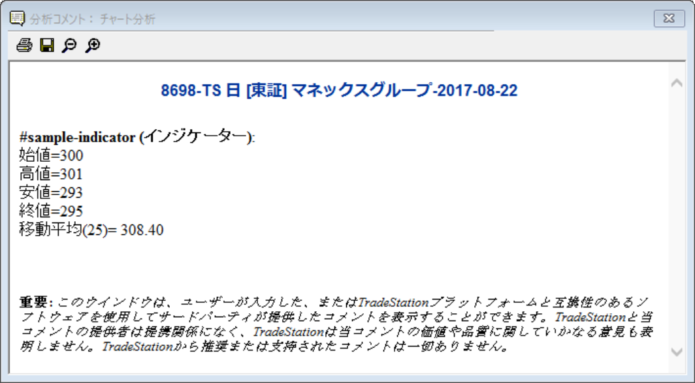
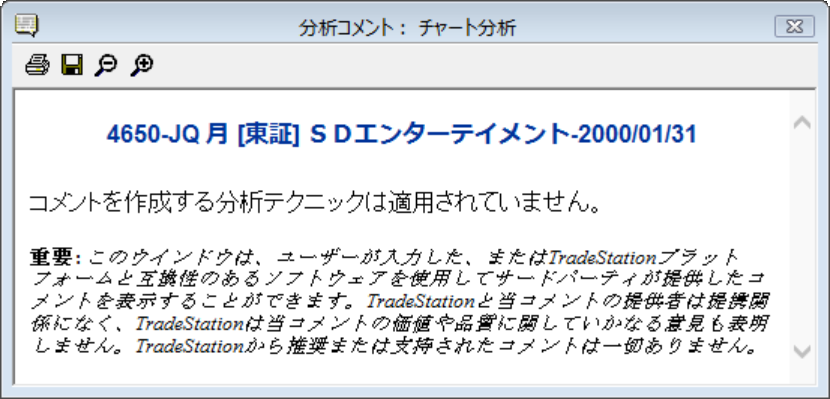

{: .center}

`Commentary` 関数によって各バーに設定しておいた注釈テキストは、下記のようにして**分析コメントウィンドウ (AnalysisCommentary Window)**に表示することができます。

1. メニューから「表示(V)」→「分析コメント(Y)」を選択
2. チャート上の任意のバーをクリック

一度分析コメントウィンドウを開いたら、左右キーを使って、隣のバーの注釈コメントを見ていくことができます。

`Commentary` 関数は、１つのバーを処理中に何度も呼び出すことができ、その場合は渡したテキストが結合されて分析コメントウィンドウに表示されます。
改行を入れるには、下記のように `NewLine` キーワードを組み合わせて使用します。

~~~
if AtCommentaryBar then begin
    Commentary("始値=", Open:0:0, NewLine);
    Commentary("高値=", High:0:0, NewLine);
    Commentary("安値=", Low:0:0, NewLine);
    Commentary("終値=", Close:0:0, NewLine);
    Commentary("移動平均(25)=", Average(Close, 25), NewLine);
end;
~~~

`Commentary` 関数は、**`AtCommentaryBar` 属性が `true` を返す場合だけ呼び出す**ようにしてください。
そのようにしておくと、ユーザがチャート上のバーをクリックしたときに、そのバーに対してのみ処理が実行されるようになります。
仮に、`AtCommentaryBar` のチェックを外してしまうと、インジケーターをチャートに適用したときに、すべてのバーに対して `Commentary` 関数の呼び出し処理が走ってしまうので、非効率なプログラムになってしまいます。
似たような属性に `CommentaryEnabled` がありますが、こちらは分析コメントウィンドウが開いている間は常に `true` となるので、あまり使い道がありません。

実は、`Commentary` の派生関数の `CommentaryCL` を使用すると、末尾に自動的に改行を入れていくれるので、上記のコードは下記のように記述することもできます。

~~~
if AtCommentaryBar then begin
    CommentaryCL("始値=", Open:0:0);
    CommentaryCL("高値=", High:0:0);
    CommentaryCL("安値=", Low:0:0);
    CommentaryCL("終値=", Close:0:0);
    CommentaryCL("移動平均(25)=", Average(Close, 25));
end;
~~~

分析コメントウィンドウは、HTML ページとして構成されているため、下記のように HTML タグを入れてテキストを装飾することができます。

~~~
if AtCommentaryBar then begin
    CommentaryCL("<b>四本値</b>");
    CommentaryCL("始値=", Open:0:0);
    CommentaryCL("高値=", High:0:0);
    CommentaryCL("安値=", Low:0:0);
    CommentaryCL("終値=", Close:0:0);
end;
~~~

トラブルシューティング: コメントを作成する分析テクニックは適用されていません
----

`Commentary` 関数や `CommentaryCL` 関数でバーに対するコメントを設定したのに、「分析コメント」のウィンドウで、下記のように表示される場合は、その分析ストラテジーがデバッグモードで実行されている可能性があります（開発環境から <kbd>F5</kbd> などで実行している）。

{: .center }

分析コメントを正しく設定するには、チャート上で「分析テクニックの挿入」を使って分析テクニックをアタッチする必要があります。

