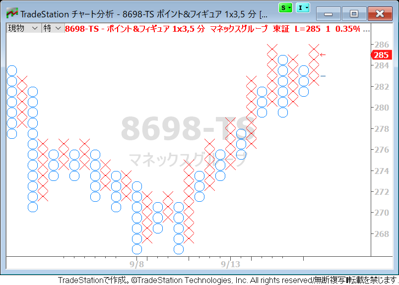
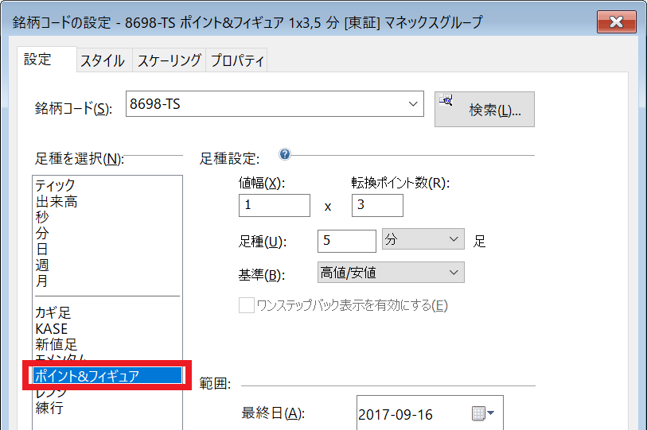

{: .center}

トレードステーションのチャート分析ウィンドウに、ポイントアンドフィギュア (P&F) を表示するには下記のようにします。

1. チャート分析ウィンドウを選択状態にする
2. メニューから「設定(O)」→「銘柄コード(S)...」を選択する （あるいは右クリック →「銘柄コードの設定」を選択する）
3. 足種から「ポイント＆フィギュア」を選択する

{: .center}

