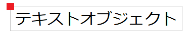
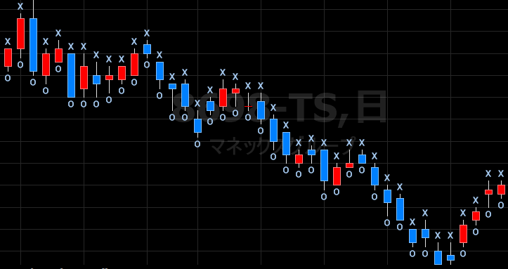

テキストオブジェクトを作成する (Text_New)
----

テキストオブジェクトを新規作成するには、`Text_New` 関数を使用します。
下記のようにすると、各バーの高値の位置に、"Hello" というテキストを表示します。

~~~
Value1 = Text_New(Date, Time, High, "Hello");
~~~
第１パラメータ（日付）、第２パラメータ（時刻）、第３パラメータ（価格）でテキストの表示位置を指定し、第４パラメータで表示する文字列を指定します。
テキストオブジェクトの生成に成功すると、`Text_New` 関数はオブジェクト ID（１以上の整数値）を返します。
このオブジェクト ID は、以降の操作のために変数に保存しておくようにします。

#### 例: キーリバーサル（前のバーより安値は低いが、終値は高い）発生時にテキスト表示

~~~
Variable: ID(-1);

If Low < Low[1] AND Close > Close[1] Then
    ID = Text_New(Date, Time, Low, "Key");
~~~

#### 例: 現在のバーの高値が、過去１０本のバーの高値よりも高い場合にテキスト表示

~~~
If High > Highest(High, 10)[1] Then
    Value1 = Text_New(Date, Time, High, "10-Bar High");
~~~

ちなみに、高値のちょっと上にテキストを表示するには、次のような価格指定 (`High + Range * 0.25`) とする方法があります。

~~~
Value1 = Text_New(Date, Time, High + Range * 0.25, "X");
~~~

テキストオブジェクトを削除する (Text_Delete)
----

`Text_New` 関数で作成したテキストオブジェクトは、`Text_Delete` 関数で削除することができます。
パラメータには、`Text_New` 関数が返したオブジェクト ID を渡します。

~~~
If Low < Lowest(Low, 10)[1] AND Value1 > 0 Then
    Text_Delete(Value1);
~~~

テキストオブジェクトの位置を移動する (Text_SetLocation)
----

既存のテキストオブジェクトの表示位置を移動するには、`Text_SetLocation` 関数を使用します。
第１パラメータには、対象のオブジェクト ID を渡し、残りの３つのパラメータで新しい表示位置（日付、時刻、価格）を指定します。

#### 例: 過去に条件を満たしてテキストオブジェクトを表示している場合は、その位置を移動させる

~~~
If High > Highest(High, 10)[1] AND Value1 > 0 Then
    Text_SetLocation(Value1, Date, Time, High);
~~~

テキストオブジェクトを削除して、新しいテキストオブジェクトを作成したい場合は、代わりに `Text_SetLocation` 関数を使用して、既存のテキストオブジェクトを使いまわす方が効率的です。

テキストオブジェクトのアラインメント位置を調整する
----

テキストオブジェクトは、左上をデフォルトのアラインメント位置として描画されます。

{: .center}

アラインメント位置を変更するには、`Text_SetStyle` 関数を使用し、水平方向と垂直方向の設定を行います。

~~~
Text_Align(オブジェクトID、水平方向の基準、垂直方向の基準)
~~~

- 水平方向の指定
  - 0: Left（デフォルト）
  - 1: Right
  - 2: Centered
- 垂直方向の指定
  - 0: Top（デフォルト）
  - 1: Bottom
  - 2: Centered

例えば、下記の例では、高値位置に x 印、安値位置に o 印を表示していますが、水平方向のアラインメントを中央に設定し、垂直方向のアラインメントをそれぞれボトムとトップに設定しています。

~~~
Value1 = Text_New(Date, Time, High, "x");
Text_SetStyle(Value1, 2, 1);  // Centered, Bottom

Value2 = Text_New(Date, Time, Low, "o");
Text_SetStyle(Value2, 2, 0);  // Centered, Top
~~~

{: .center}

