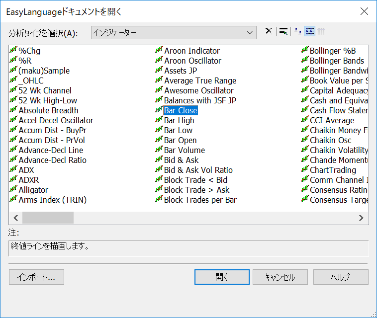

トレードステーションの開発環境で、下記のようにして組み込みのインジケーターや、関数のコードを参照することができます。
EasyLanguage によるコーディングの参考にするとよいでしょう。

1. TradeStation 開発環境のメインメニューから「ファイル(<u>F</u>)」→「開く(<u>O</u>)...」を選択。あるいは `Ctrl-O` と入力。
2. 下記のダイアログが開くので、分析タイプから「インジケーター」などを選択して、参照したいコードを選択。

{:.center}

