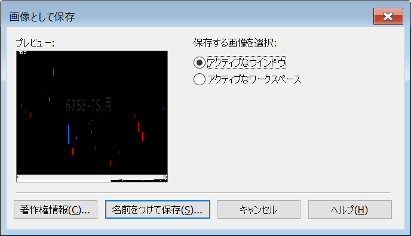
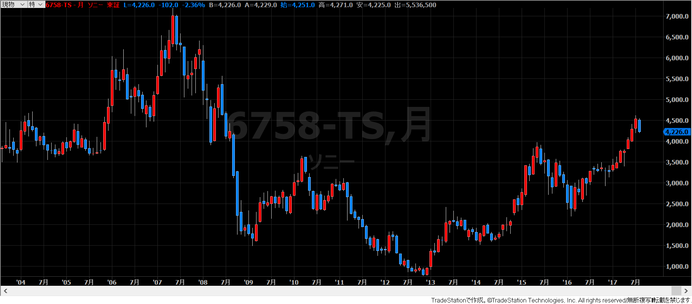

トレードステーションには、アプリーケーション全体（デスクトップ）のスクリーンキャプチャや、任意のアクティブなウィンドウのスクリーンキャプチャを撮る機能が搭載されています。
スクリーンキャプチャを撮るには下記のようにします。

1. メインメニューから「ファイル(<u>F</u>)」→「画像として保存(<u>I</u>)...」を選択する。
2. 下記の画面が開くので、アクティブなウィンドウだけのキャプチャを撮るか、アプリ全体のキャプチャを撮るかを選択します。

{:.center}

例えば、次のようなチャートのキャプチャを取得することができます。

{:.center}

