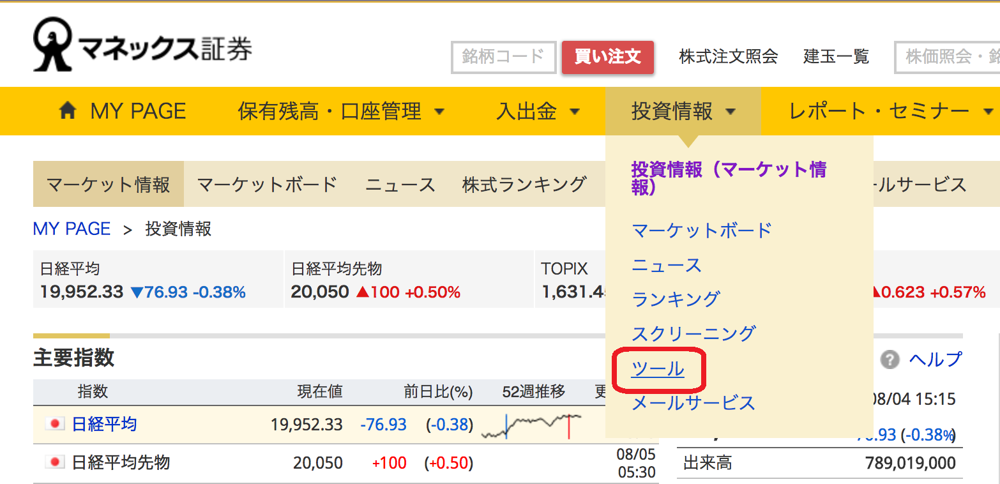
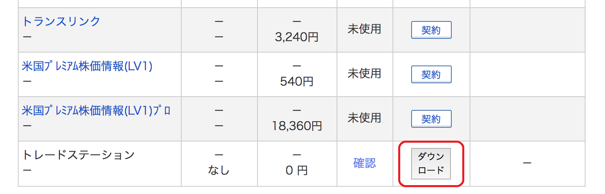

日本の証券会社においてトレードステーションを利用するには、マネックス証券に口座を開く必要があります。
マネックスにログインすると、下記の「投資情報」のリンクからトレードステーションをダウンロードすることができます。

{:.center}

ツール一覧の中の「トレードステーション」の項目からダウンロードできます。

{:.center}

あとはインストーラを起動して手順通りにインストールすれば完了です。

