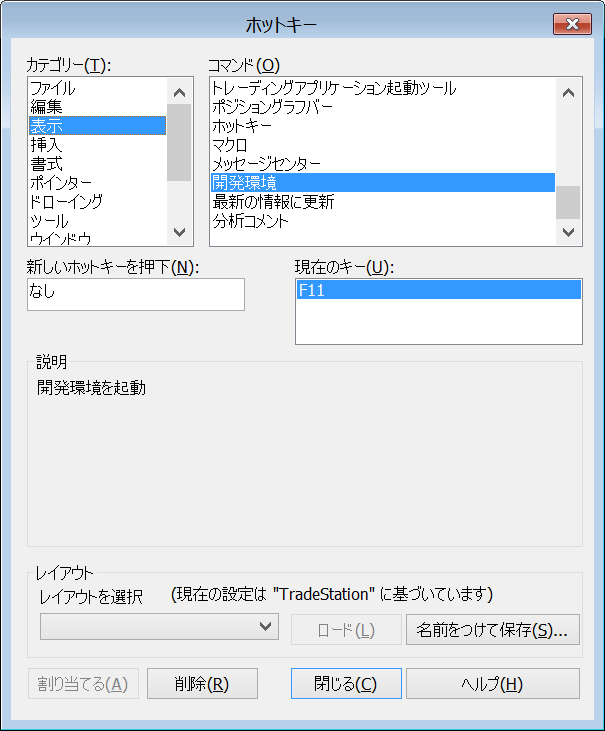

トレードステーションのデスクトップ環境使用中に、トレードステーション開発環境（EasyLanguage 開発環境）を開くショートカットキーはデフォルトでは割り当てられていません。

トレードステーション開発環境は、メニューから <kbd><samp>表示(<u>V</u>)</samp></kbd> → <kbd><samp>EasyLanguage開発環境(<u>L</u>)</samp></kbd> と辿れば開くことができるのですが、ショートカットキーを割り当て簡単に開けるようにしておくと便利です。

例えば、開発環境にショートカットキー（公式用語は「ホットキー」）として <kbd>F11</kbd> キーを割り当てるには以下のようにします。

{: .center }

1. メニューから <kbd><samp>表示(<u>V</u>)</samp></kbd> → <kbd><samp>ホットキー(<u>H</u>)...</samp></kbd> を選択。
2. カテゴリーで <kbd><samp>表示</samp></kbd>、コマンドで <kbd><samp>開発環境</samp></kbd> を選択。
3. <kbd><samp>新しいホットキーを押下</samp></kbd> という部分を選択し、<kbd>F11</kbd> を押して、<kbd><samp>割り当てる</samp></kbd> ボタンをクリック（あるいは <kbd>Enter</kbd> キー）。

これで、<kbd>F11</kbd> キーで簡単に EasyLanguage のプログラミング環境に移動できるようになります。
すでに開発環境が開いている場合は、ウィンドウだけ切り替えてくれます。

ショートカットキーとしては、任意のキーを割り当てることができますが、<kbd>F11</kbd> キーを割り当てることをお勧めします。
なぜなら、11（イイ）ジーラングエジって覚えやすいからです（^^;

