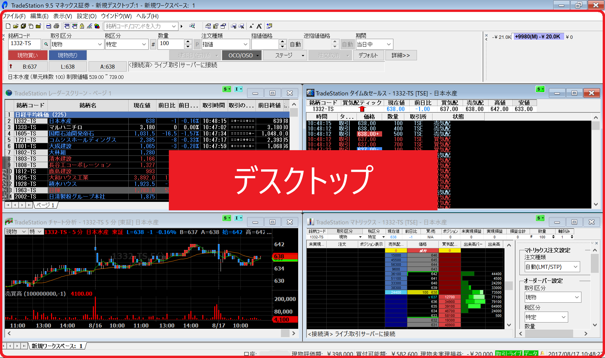
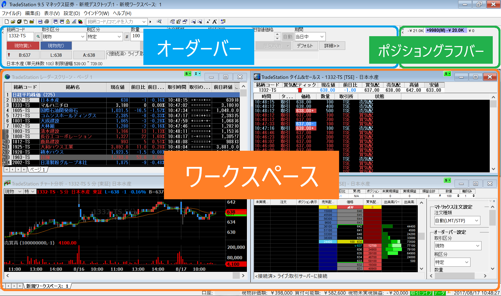
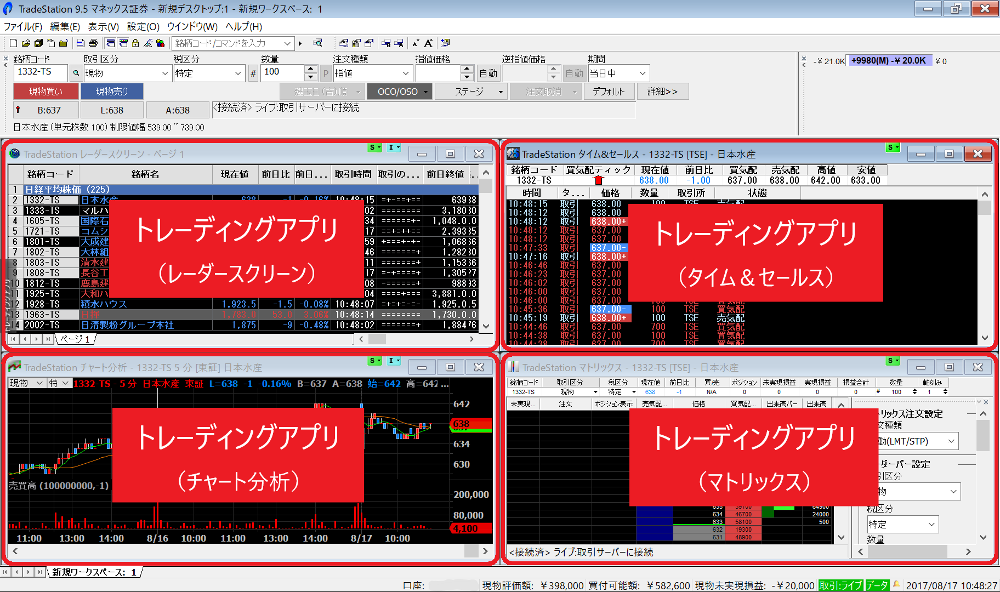

トレードステーションの画面は多くの要素から構成されており、最初は複雑に見えるかもしれません。
まずは、それぞれの構成要素の名前を理解しましょう。

デスクトップ
----

{:.center}

TradeStation アプリを起動したときに表示されるウィンドウ全体のことを**デスクトップ**と呼びます。

デスクトップ内の構成
----

{:.center}

デスクトップの中には、**オーダーバー**や、**ポジショングラフバー**、**ワークスペース**などが配置されます。
表示する要素は、メニューの「表示」から選択することができます。
オーダーバーや、ポジショングラフバーは、必要がなければ × アイコンを押して閉じることができます。

デスクトップの中には、複数のワークスペースを作成することができ、画面下に表示されたタブで切り替えることができます。

ワークスペース内の構成
----

{:.center}

ワークスペースの中には、様々な分析用のアプリケーションウィンドウ（**トレーディングアプリ**）を配置することができます。
トレーディングアプリを追加したいときは、画面左の「トレーディングアプリ」と表示された部分をクリックします（表示されていないときは、メニューの「表示」から「トレーディングアプリケーション起動ツール」にチェックを入れてください）。

