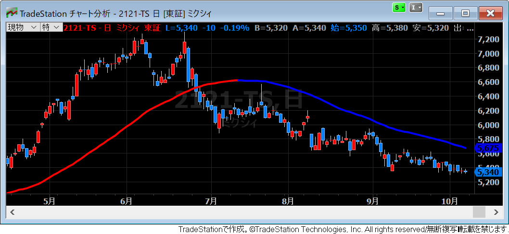

{: .center }

上昇トレンドや下降トレンドをどう定義するかは意見が分かれるところですが、ここでは単純に長期の移動平均線の傾きで調べることにしましょう。

移動平均の値は、`Average` 関数で取得することができるので、まずはこれを変数値に保持します。
ここでは、50本分のバーの移動平均値を使用します。

~~~
Vars: myAvg(0);
myAvg = Average(Close, 50);
~~~

移動平均線の傾きが右肩上がりかどうかを調べるには、ひとつ前の足の移動平均値と比べて上昇しているかを調べればよいので、下記のような条件判定を行えばよいことになります。

~~~
If myAvg > myAvg[1] then begin
    // 上昇トレンド
end;
~~~

EasyLanguage では、変数にインデックスを付けてアクセスすると、過去の足における変数値を遡って参照することができます。<code>myAvg[1]</code> は、ひとつ前の足の <code>myAvg</code> 変数の値を示しています。

下記のサンプルコードは、移動平均線を表示するインジケーターで、右肩上がりのときは赤色、右肩下がりのときは青色の線を描画するようにしています。

~~~
Vars: myAvg(0);

myAvg = Average(Close, 50);
SetPlotWidth(1, 3);  // 線を太めに
If myAvg > myAvg[1] then begin
    SetPlotColor(1, Red);  // 上昇トレンドは赤線
end
Else begin
    SetPlotColor(1, Blue);  // 下降トレンドは青線
end;
Plot1(myAvg);
~~~

このインジケーターをチャート分析ウィンドウに適用すると、下記のように表示されます。

{: .center }

