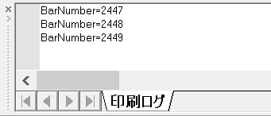

{: .center}

Print 関数と印刷ログ
----

Print 関数（ステートメント）は、インジケーターや自動売買ストラテジの動作過程を確認するのに非常に便利です。
Print 関数による出力結果は、**印刷ログウィンドウ**に表示されるので、まずはこのウィンドウを表示しておく必要があります。

1. メニューから「表示(V)」→「EasyLanguage印刷ログ(E)」を選択 （あるいは、**Ctrl+Shift+E**）

下記は、インジケーターの中での使用例です。

#### 例: 現在処理中のバーのインデックス番号（１始まり）を表示

~~~
Print("BarNumber=", BarNumber:0:0);
~~~

カンマで区切って渡された複数の値は、出力時には繋げて表示されます。
後ろの `BarNumber:0:0` の部分は、処理中の足の番号を表す `BarNumber` を、整数値として表示すること（１つ目の数字は整数部分の最低桁数、２つ目の数字は小数点以下の桁数）を示しています。
インジケータは、バーごとに呼び出されるので、上記のインジケータをチャートに適用すると、下記のように何度も印刷ログに出力されることになります。

~~~
BarNumber=1
BarNumber=2
BarNumber=3
...
BarNumber=2447
BarNumber=2448
BarNumber=2449
~~~

一度だけ表示する
----

デバッグ用に、インジケーター中で一度だけ処理したい部分は、`Once begin ～ end` で囲みます。

~~~
once begin
    Print("BarNumber=", BarNumber:0:0);
end;
~~~

このブロックで囲まれた部分は、あるチャートにインジケーターを適用したときに、最初のバーの処理時だけ呼び出されるようになります。

#### 実行結果

~~~
BarNumber=1
~~~

出力先をファイルに切り替える
----

下記のように、`Print` 関数の最初のパラメータに `File` ステートメントを指定すると、出力先を印刷ログウィンドウからテキストファイルに切り替えることができます。
長大なログを出力して、じっくりと分析する際に使用できるでしょう。

#### 例: テキストファイルに各バーの終値を出力する

~~~
Print(File("c:\data\mydata.txt"), Date, Time, Close:0:0);
~~~

ただし、ファイルの出力となる `c:\data` ディレクトリは、あらかじめ作成しておく必要があります。
ディレクトリが存在しない場合は、下記のような例外が発生します。

~~~
elsystem.io.WriteFileException: Error creating file: c:\data\mydata.txt
~~~

ちなみに、次のように相対パスでファイル名を指定すると、トレードステーションのインストールディレクトリ下にある `Program` ディレクトリ内にファイルが出力されるようです。

#### よくない例

~~~
Print(File("mydata.txt"), Date, Time, Close:0:0);
~~~

このディレクトリには、トレードステーション本体用のファイルがたくさん格納されているので、ここに出力するのは得策ではないでしょう。
`Print` 関数の出力先をファイルに切り替えるときは、出力パスをフルパスで指定するようにしましょう。

