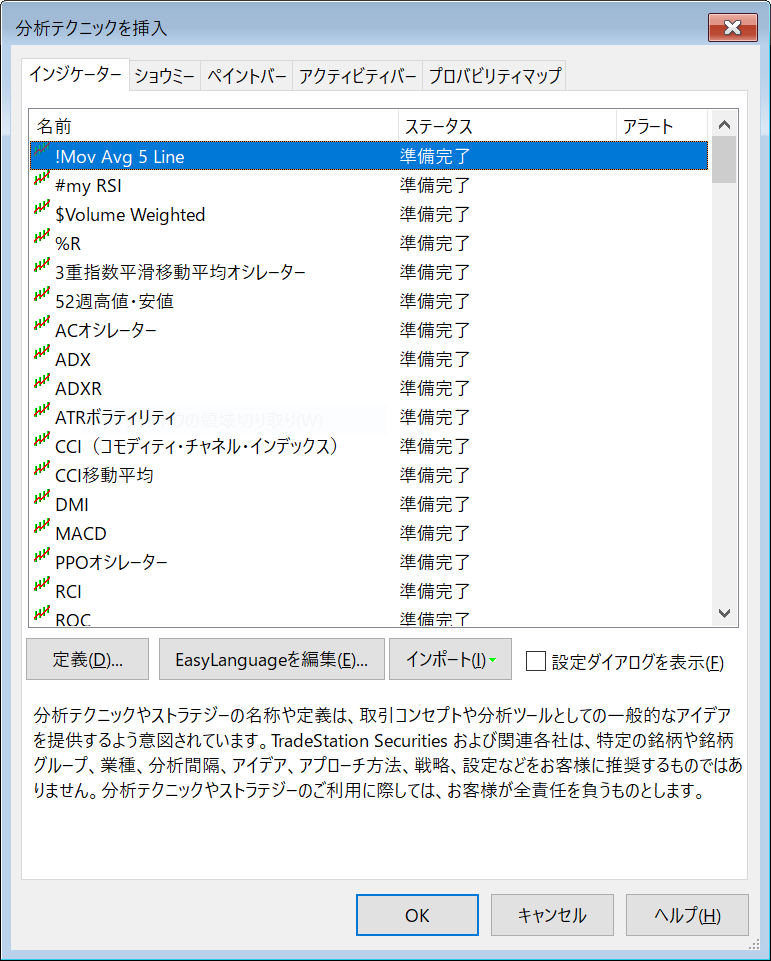

独自に作成するインジケーター名には、アルファベットだけではなく、記号も含めることができます。
Alt+C で表示される「分析テクニックを挿入」ウィンドウには、記号で始まるインジケーター名が一番上に表示されるので、記号をプレフィックスとして付けるのがよいとされています。
例えば、下記のような名前を付けるようにします。

~~~
!Mov Avg 5 Line
#my RSI
$Volume Weighted
~~~

上記のような名前で作成されたインジケーターは、「分析テクニックを挿入」のウィンドウに、次のように並びます。

{: .center}

