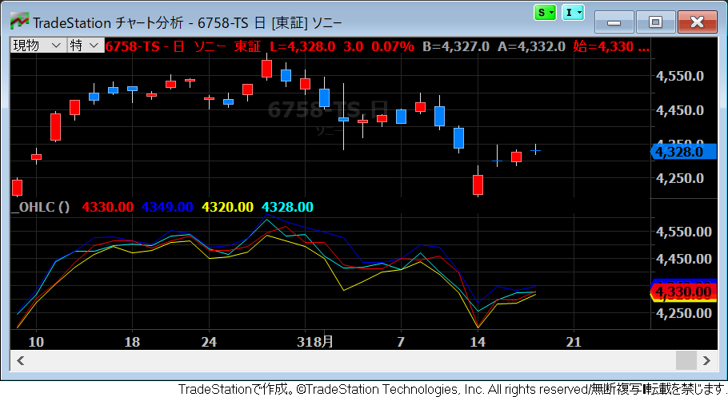

現在の足の四本値を取得する
----

下記のキーワードを使用して、現在の足の四本値を取得することができます（大文字と小文字の区別はありません）。

- `Open` or `O`: 始値
- `High` or `H`: 高値
- `Low` or `L`: 安値
- `Close` or `C`: 終値

例えば、下記のようにインジケーターを実装すれば、四本値を結んだ４つのラインを描画することができます。

~~~
Plot1(Open, "始値");
Plot2(Close, "終値");
Plot3(High, "高値");
Plot4(Low, "安値");
~~~

{:.center}

四本値は `o`、`h`、`l`、`c` のような１文字の省略形でも参照できるようになっているため、ユーザ定義の変数とかぶらないように注意してください。
ユーザ定義の変数は、`my` などの決まったプレフィックスを付けるか、２文字以上の名前を付けるようにするとよいでしょう。

四本値の値同士で計算を行うことで、色々な値を求めることができます。
例えば、高値から安値を引くことで、値幅を計算することができます。

~~~
Plot1(High - Low, "値幅");
~~~

ちなみに、値幅は `Range` 関数を使用して、単純に下記のように取得することができます。

~~~
Plot1(Range, "値幅");
~~~

過去の足の四本値を取得する
----

現在の終値は `Close` で参照することができますが、`Close[n]` のようにインデックスを指定することで、n 本前の足の終値を参照することができます。

- 現在の足の終値: `Close` or `Close[0]`
- １足前の終値: `Close[1]`
- ５足前の終値: `Close[5]`
- ５足前の値幅: `High[5] - Low[5]` or `(High - Low)[5]`

