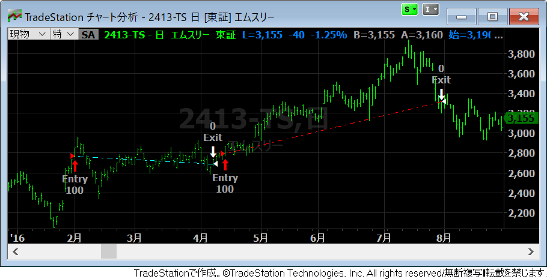
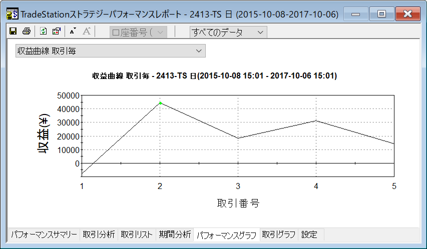
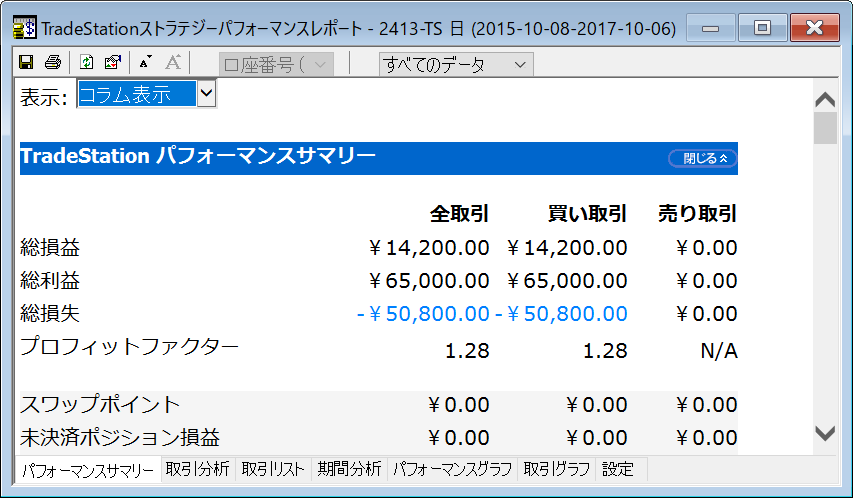

ストラテジを用意する
----

ここでは、下記のようなサンプルストラテジを使ってバックテストを行う手順を示します。
このストラテジでは、上昇トレンドが発生しているときに、移動平均線のゴールデンクロスで 100 株の買い（ロング）ポジションを取り、デッドクロスで決済を行います。

~~~
Vars: myShortMa(0), myMidMa(0), myLongMa(0);

myShortMa = Average(Close, 5);  // 短期移動平均
myMidMa = Average(Close, 25);   // 中期移動平均
myLongMa = Average(Close, 50);  // 長期移動平均

// ロングでのエントリーは、長期の上昇トレンド時に限定する
if myLongMa >= myLongMa[1] then
begin
    // 短期と中期の移動平均線のゴールデンクロスで買い
    if myShortMa crosses above myMidMa then Buy("Entry") next bar 100 shares at market;
end;

// 短期と中期の移動平均線のデッドクロスで決済
if myShortMa crosses below myMidMa then Sell("Exit") next bar at market;
~~~

トレードステーションの開発環境から、**ファイル(<u>F</u>) → 新規作成(<u>N</u>) → ストラテジー(<u>S</u>)** を選択すると、新しいストラテジーを作成するためのエディタが開きます。
上記のコードを入力して、`F3` キーを押してコンパイルしてください。
これで自動売買のためのストラテジーは完成です。

チャートにストラテジを適用する
----

まずは、ストラテジを適用する銘柄のチャート分析ウィンドウを開いてください。
チャート分析ウィンドウに下記のようにしてストラテジを追加します。

1. チャート上で右クリックして、「ストラテジーを挿入...(<u>R</u>)」を選択。
2. 適用するストラテジーを選択。

あるいは、

1. メニューから「挿入(<u>I</u>)」→「ストラテジー(<u>T</u>)...」を選択。
2. 適用するストラテジーを選択。

ストラテジーを適用すると、チャート上にどの位置で売買が行われるかが表示されます。
ローソク足の色を白黒にしたり、バーチャートに切り替えると見やすくなります。

{: .center }

チャート上には EasyLanguage の売買注文命令で指定したラベルが表示されます。
今回のサンプルでは、`Buy("Entry")` や `Sell("Exit")` のようにコーディングしているので、チャート上にもそれぞれの注文位置で `Entry`、`Exit` と表示されています。
慣例としてはストラテジーの名前なども含めるようですが、今回は表示をシンプルにするために、Entry と Exit のタイミングだけ分かるようにしています。
その上下の数値は、その時点でポジション数がどう変化したかを示しています。
ショートポジションを持っているときはマイナスの数値が表示されます。
今回のサンプルでは買いから入り、決済して終わり、という戦略をとっていますので、ショートポジションを取ることはありません（マイナスの数値は表示されません）。

パフォーマンスレポートを表示する
----

チャート分析ウィンドウにストラテジーを適用したら、パフォーマンスレポート（バックテストの結果）を表示することができます。

1. チャート分析ウィンドウを選択状態にする。
1. オプションメニューから「表示(<u>V</u>)」→「ストラテジーパフォーマンスレポート(<u>F</u>)」を選択。あるいは、ショートカットキーで `Alt + Shift + P` と入力。

{: .center }

{: .center }

パフォーマンスレポートでは、上記のように、損益グラフや、最大ドローダウン、プロフィットファクターなどを表示することができます。

このパフォーマンスレポートのウィンドウを開いた状態で、チャートに表示する銘柄を切り替えていくと、同じストラテジーを異なる銘柄に適用したときのパフォーマンスを次々と見ていくことができます。
やってみると分かるのですが、同じストラテジーを使用していても、適用する銘柄が変わると、損益グラフは大きく変化します。
特定の銘柄だけでバックテストを行うことがどれだけ危険かがよく分かります。

