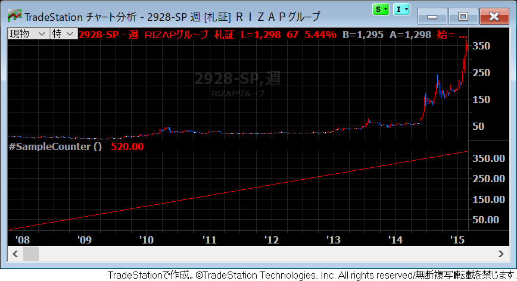

変数を定義する
----

EasyLanguage の中で変数を定義するには、下記のいずれかのキーワードを使用します（すべて同じ意味です）。個人的には `Vars` が好きです。

~~~
Variables:
Variable:
Vars:
Var:
~~~

変数は、その初期値に応じて、数値、真偽値 (true or false)、文字列といった型の値を保持します。
変数の初期値は、必ず変数名の後ろに続けて指定する必要があります（文法上省略できません）。
下記の例では、３つの変数（数値、真偽値、文字列）を定義しています。

~~~
Vars: LastHigh(0), NewHigh(false), HighAlert("");
~~~

次のように複数行に分けて定義することも可能です。
この書き方は、変数の説明をコメントで記述するときに便利です。

~~~
Vars:
    LastHigh(0),     { Creates a numeric variable }
    NewHigh(false),  { Creates a true/false variable }
    HighAlert("");   { Creates a text variable }
~~~

EasyLanguage では、１文字の単語が予約語とされているものがある (`O`、`H`、`L`、`C` など）ため、変数名には１文字の名前を付けないようにしましょう。
`myHogeHoge` のように `my` プレフィックスを付けるといった工夫をするとよいでしょう。
ちなみに変数名の最大文字数は 42 文字で、大文字と小文字の違いは無視されます。

変数に代入する
----

変数には、`=` 演算子を使用して新しい値を代入することができます。

~~~
Vars: FastAverage(0), SlowAverage(0);

FastAverage = Average(Close, 9);
SlowAverage = Average(Close, 18);
~~~

上記の例では、現在のバーから見て過去９本分の移動平均値と、過去18本分の移動平均値を変数に代入しています。

変数はバー間で引き継がれる
----

EasyLanguage の変数は、各バーの計算処理を行う際に、**前回のバーで変数が保持していた値を引き継ぐ**という特徴があります。
例えば、下記のインジケータープログラムは、変数の値をただプロットするだけのものですが、各バーの計算処理のたびに、変数の値は１ずつ増えていきます。

~~~
Vars: myCounter(0);

myCounter += 1;
Plot1(myCounter, "SampleCounter");
~~~

このインジケーターをチャート分析ウィンドウに適用すると、`myCounter` 変数の値が、各バーごとに１ずつ増えていく様子が分かります。
`Vars:` キーワードのところで指定した初期値による初期化は、一番最初のバーでのみ実行されるということですね。

{: .center }

過去のバーの変数値を参照する
----

上記の説明の通り、変数の値は次のバーの計算処理に引き継がれるのですが、過去のバーに遡って変数値を参照することもできます。
例えば、１つ前のバーにおける `myCounter` 変数の値は、`myCounter[1]` というように参照することができます（１つ前の終値を `Close[1]` で参照できるのと同様ですね）。

下記のストラテジーでは、９本足の移動平均値を `myAvg` 変数に格納しています。
`myAvg[3]` とすると、３本前の移動平均値を参照できるので、これと現在の移動平均値を比べて、ゴールデンクロスで買い、デッドクロスで売り、という戦略を実装しています。

~~~
Vars: myAvg(0);

myAvg = Average(Close, 9);
if myAvg Crosses above myAvg[3] then Buy next bar 100 shares at market;
if myAvg Crosses below myAvg[3] then Sell next bar at market;
~~~

まったく根拠のないストラテジーなので、これを実際の自動売買には使用しないでください。

