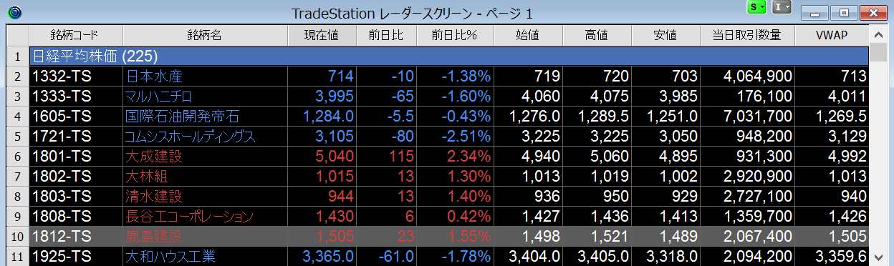

レーダースクリーンに銘柄を追加する
----

### 銘柄コードで追加

{: .center }

レーダーチャートのセルを選択した状態で、銘柄コードを入力して <kbd>Enter</kbd> を押すだけで、次々と銘柄を追加していくことができます。

逆に、登録された銘柄を削除するには、対象の銘柄のセルを選択した状態で <kbd>Delete</kbd> キーを押します。
<kbd>Ctrl-A</kbd> で全銘柄を選択した状態で <kbd>Delete</kbd> キーを押せば、全銘柄を一気に削除することができます。

### 銘柄名で検索して追加

銘柄コードが分からない場合は、下記のように「銘柄名」で検索して追加することができます。

1. レーダーチャートを<kbd>右クリック</kbd> → <kbd><samp>銘柄コードを挿入</samp></kbd> を選択。あるいは、<kbd><kbd>Alt</kbd>+<kbd>S</kbd></kbd> を入力
2. <kbd><samp>検索</samp></kbd> ボタンをクリック。あるいは <kbd><kbd>Alt</kbd>+<kbd>L</kbd></kbd> を入力
3. 「株式」タブで銘柄名を入力して <kbd>Enter</kbd>
4. 見つかった銘柄を選択した状態で <kbd><samp>OK</samp></kbd> ボタンをクリック

レーダースクリーンの銘柄をドラッグ＆ドロップで移動する
----

{: .center }

下記のようにすると、登録したシンボルの位置（行）をドラッグ＆ドロップで移動することができます。

1. 移動する銘柄の行番号をクリックして選択状態にする（ドラッグで複数の銘柄を選択することも可能）
2. 選択された状態の行番号を、さらにドラッグして移動させたい場所へドロップ（移動先に赤矢印が表示されます）

未選択の状態からいきなりドラッグ＆ドロップすることはできないことに注意してください。
移動させるセルをあらかじめ選択状態にしておく必要があります。
一見面倒に感じるかもしれませんが、この仕様のおかげで、複数のセルをドラッグして選択しておいて、まとめて移動させることができるようになっています。

レーダースクリーンにラベル行を追加して銘柄をグルーピングする
----

{: .center }

レーダースクリーンに多くの銘柄を登録する場合は、ラベル行を追加して銘柄をグルーピングしておくとよいでしょう。

1. ラベルを挿入したい行の銘柄コードのセルを<kbd>右クリック</kbd> → <kbd><samp>ラベル行を挿入</samp></kbd> を選択する
2. 「ラベル行」という名前のラベル行が追加されるので、<kbd>ダブルクリック</kbd> するか <kbd>F2</kbd> キーを押して好きな名前に変更する

レーダースクリーンにシンボルリスト（日経225銘柄など）を一度に登録する
----

複数の銘柄をリスト化したものを**シンボルリスト**と言います。
例えば、日経225銘柄のシンボルリストを利用すると、レーダースクリーンに日経225銘柄を一度に登録することができます。

1. 銘柄を挿入したい場所の銘柄コードのセルを<kbd>右クリック</kbd> → <kbd><samp>シンボルリストを挿入</samp></kbd> を選択。
2. 「シンボルリストを挿入」のダイアログの中から、登録したいシンボルリストを選択する（ここでは <samp>日経平均株価(225)</samp> を選択する）。
{: .center }
3. <samp>日経平均株価 (225)</samp> というラベル名と共に、225銘柄のシンボルが登録されます。
{: .center }

他にも、TOPIC Core 30 などのシンボルリストが組み込みで用意されています。

