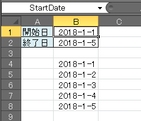

{: .center }

図のような「開始日」と「終了日」のセルに日付を設定するだけで、その間の日付を自動的にリストアップするマクロの例です。
これを応用すると、カレンダーや、スケジュール表などを自動で生成することができるようになります。

「開始日」と「終了日」の入力フィールドには、`StartDate` と `EndDate` という名前を付けておいてください（左上のテキストフィールドに入力します）。

~~~ vb
Sub UpdateDates()
    Dim d As Date, endDate As Date
    d = Range("StartDate").Value
    endDate = Range("EndDate").Value

    Dim y As Long
    y = 4
    Do While d <= endDate
        cells(y, 2) = d
        d = d + 1
        y = y + 1
    Loop
End Sub
~~~

上記のマクロを実行すると、B4 のセルから下方向に、日付がインクリメントされながら自動的に入力されます。

### 完成版サンプル

下記は、さらに実用的になるように修正したコードです。
「開始日」や「終了日」のセルの値を変更すると、自動的に出力内容が更新されるようになっています。
また、日付フォーマット以外のテキストが入力された場合は、エラーメッセージを表示するようになっています。

~~~ vb
Option Explicit

'日付フィールドの変更を監視
Private Sub Worksheet_Change(ByVal target As Range)
    If Intersect(target, Range("StartDate:EndDate")) Is Nothing Then
        Exit Sub
    End If

    ClearDates
    UpdateDates
End Sub

'前回の出力内容をクリア
Sub ClearDates()
    Range("B4:B9999").Clear
End Sub

'指定した範囲の日付をリストアップ
Sub UpdateDates()
    '正しく日付が入力されているか確認
    If IsDate(Range("StartDate").Value) = False Or IsDate(Range("EndDate").Value) = False Then
        MsgBox "日付を正しく入力してください"
        Exit Sub
    End If

    '入力された日付を取得
    Dim d As Date, endDate As Date
    d = Range("StartDate").Value
    endDate = Range("EndDate").Value

    'リストアップ
    Dim y As Long
    y = 4
    Do While d <= endDate
        cells(y, 2) = d
        d = d + 1
        y = y + 1
    Loop
End Sub
~~~

