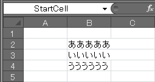

Offset プロパティによるセルの参照
----

Range オブジェクトの Offset プロパティを使用すると、その Range オブジェクトが示すセルからのオフセット値を指定してセルを参照することができます。

#### 例: A1 セルから下に１、右に３移動したセルを参照（= B4）

~~~ vb
MsgBox Range("A1").Offset(1, 3)
~~~

縦横どちらかのオフセットだけを指定する場合は、下記のように名前付きパラメータを使用するとわかりやすいです。

#### 例: A1 セルの１つ下のセルを参照

~~~ vb
MsgBox Range("A1").Offset(RowOffset := 1)
~~~

名前付きセルを起点にしたループ処理
----

{: .center }

ここでは、上記のように、"StartCell" という名前のついた B2 セルから、下方向にデータのある限りループ処理を行う例を示します。
Range オブジェクトの Offset プロパティを利用して、1 つずつ参照するセルをずらしていくという方法を使用します。

#### StartCell という名前のセルから空のセルに到達するまで下方向へ１セルずつ処理

~~~
Sub Test()
    Dim startCell As Range
    Set startCell = Range("StartCell")
    Dim i As Long
    Dim r As Range

    Do
        Set r = startCell.Offset(RowOffset := i)
        If r = "" Then
            Exit Do
        End If
        Debug.Print r.Address & " = " & r
        i = i + 1
    Loop
End Sub
~~~

#### 実行結果（イミディエイトウィンドウ）

~~~
$B$2 = あああああ
$B$3 = いいいいい
$B$4 = うううううう
~~~

