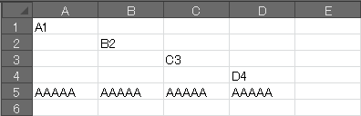
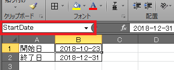
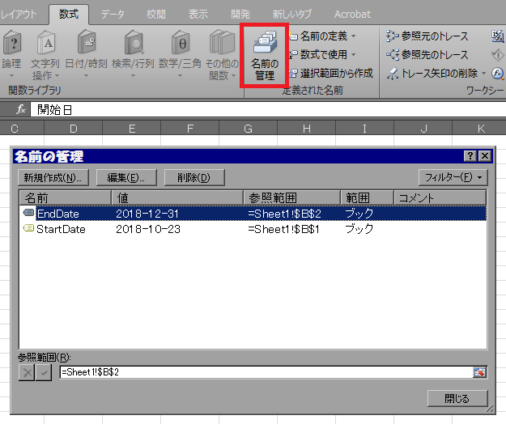
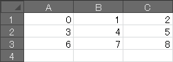

Excel VBA マクロの中では、下記のようにいろいろな方法でセルを参照することができます。

インデックス指定でセルを参照する
----

~~~ vb
Sub Test()
    '単一のセルの内容を変更
    Range("A1").Value = "A1"
    Cells(2, 2).Value = "B2"  'Cells.Item(2, 2) の省略系
    [C3].Value = "C3"
    Range("D4:E5").Cells(1).Value = "D4"

    '複数のセルの内容を変更
    Range("A5:D5").Value = "AAAAA"
End Sub
~~~

このマクロを実行すると、各セルの内容が次のように変更されます。

{: .center }

`.Value` の部分は既定のプロパティとなっており、省略することが可能ですが、明示的に記述しておいた方がよいでしょう。

~~~ vb
Cells(1, 1).Value = "Hello"  'Good
Cells(1, 1) = "Hello"        'NG
~~~

名前を付けたセルを参照する
----

VBA マクロの中から、特定の位置のセルを参照するときは、**あらかじめそのセルに名前を付けておく**ことをお勧めします。
そうすることで、ユーザが行や列を追加したときにインデックスがずれてマクロが動作しなくなることを防ぐことができます。

{: .center }

セルに名前を付けるには、対象のセルを選択して、左上のテキスト領域に好きな名前を入力するだけです（初期値は `A1` などになっています）。
この名前は、今まで `A1` や `B2` のように指定していた部分で使用することができます。

~~~ vb
Sub Test()
    MsgBox Range("StartDate").Value
End Sub
~~~

複数セルを選択した状態で名前を付ければ、`A1:B2` のような範囲指定の代わりにその名前を使用できるようになります。
この機能を使うことでコードの可読性がよくなりますので、積極的に使用したいところです。

作成した名前の管理は、「数式」タブの「名前の管理」から行うことができます。

{: .center }

Range 指定した複数セルをループ処理する
----

Range オブジェクトの Cells プロパティを参照すると、指定した領域のセルを1階層のループで処理することができます。

~~~ vb
Sub Test()
    Dim r As Range
    Dim count As Long

    For Each r In Range("A1:C3").Cells
        r.Value = count
        count = count + 1
    Next
End Sub
~~~

上記マクロを実行すると、A1:C3 の範囲のセルが次のように設定されます。

{: .center }

Cells プロパティで参照できる要素のインデックスは1から始まるため、次のようにするのと同様の振る舞いをすることになります。

~~~ vb
Sub Test()
    Dim cells As Range
    Set cells = Range("A1:C3").cells
    cells(1) = 0
    cells(2) = 1
    cells(3) = 2
    cells(4) = 3
    cells(5) = 4
    cells(6) = 5
    cells(7) = 6
    cells(8) = 7
    cells(9) = 8
End Sub
~~~
