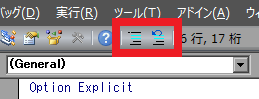

VB エディタのメニューから次のようにすると、複数行まとめてコメントアウトするボタンをツールバーに追加することができます。

{: .center }

1. 「表示(V)」→「ツールバー(T)」→「ユーザ設定(C)...」を選択 あるいは、ツールバーを右クリックして「ユーザ設定(C)...」を選択
2. 「コマンド」タブの分類で「編集」を選択
3. 「コメントブロック」と「非コメントブロック」のアイコンをツールバーの好きな場所にドラッグ＆ドロップ

あとは、エディタ上でコメントアウトしたい行を選択した状態で、「コメントブロック」アイコンをクリックすることで、一気にコメントアウトすることができます。
元に戻すには、同じように行選択して「非コメントブロック」アイコンをクリックします。

