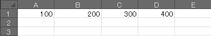
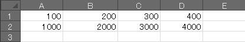

無限ループ (Do ~ Loop)
----

Do ~ Loop によるループは、無限ループになるので、何らかの条件を満たした時に `Exit Do` を明示的に呼び出してループを抜ける必要があります。

~~~ vb
Dim i As Long
Do
    If i >= 3 Then
        Debug.Print "ループを抜けます"
        Exit Do
    End If
    Debug.Print "Count = " & i
    i = i + 1
Loop
~~~

### 実行結果（イミディエイトウィンドウへ出力されます）

~~~
Count = 0
Count = 1
Count = 2
ループを抜けます
~~~

数値による For ループ
----

#### 1 から 5 までのループ

~~~ vb
Sub Test()
    Dim i As Integer
    For i = 1 To 5
        Cells(i, 1).Value = i * 100
    Next i
End Sub
~~~

2重ループも同様に記述できます。

~~~ vb
Sub Test()
    Dim x As Integer, y As Integer

    For y = 1 To 2
        For x = 1 To 5
            Cells(y, x).Value = x & "," & y
        Next
    Next
End Sub
~~~

Step キーワードと組み合わせることで、数値を減らしながらループ処理することもできます。

#### 3, 2, 1, 0 とカウントダウン

~~~ vb
Sub CountDown()
    Dim i As Long
    For i = 3 To 0 Step -1
        Debug.Print i
    Next
End Sub
~~~

Do While ループ
----

### 数値によるループ

~~~ vb
Sub Test()
    Dim i As Integer
    i = 1

    Do While i < 5
        Cells(1, i).Value = i * 100
        i = i + 1
    Loop
End Sub
~~~

### 右に見て行って、空のセルが登場するまで繰り返し

~~~ vb
Dim i As Integer
i = 1

Do While Cells(1, i).Value <> ""
    Cells(2, i).Value = Cells(1, i).Value * 10
    i = i + 1
Loop
~~~

#### 実行前

{: .center }

#### 実行後

{: .center }

Excel の Range オブジェクト内のセルをループ
----

~~~ vb
Sub Test()
    Dim r As Range
    For Each r In Range("A1:C3")
        r.Value = r.Address
    Next
End Sub
~~~

このコードを実行すると、A1 ～ C3 の各セルに `$A$1` ～ `$C$3` というテキストが設定されます。

