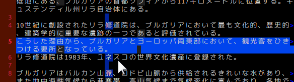

ビジュアルモードの開始・終了
----

ビジュアルモードは、Vim においてテキストの範囲選択を行うためのモードです。
ノーマルモードで下記のようなコマンドを入力することでビジュアルモードに入ることができます。

~~~
v       -- ビジュアルモード（文字単位）
V       -- ビジュアルラインモード（行単位）
Ctrl-v  -- ビジュアルブロックモード（矩形）
~~~

ビジュアルモードを抜けてノーマルモードに戻るには、<kbd>Esc</kbd> を押すか、何かコマンドを実行します（<kbd>d</kbd> で削除するなど）。
コマンドを実行した場合は、選択した範囲に対してコマンドが適用されます。

ビジュアルモードの選択範囲を拡張する
----

### カーソル移動で拡張する

{: .center }

ビジュアルモードに入った後で `o` を入力することで、カーソル位置を選択領域の先頭、末尾へ交互に移動することができます。
この状態でカーソルを動かすと、選択領域を自在に伸縮させることができます。

### ルールに応じて拡張する

{: .center }

ビジュアルモードに入った後で、下記のような操作を行うと、ルールに従って選択範囲を拡張することができます。

~~~
ip -- カーソル位置の段落全体を選択
ap -- カーソル位置の段落全体を選択（後続の空行も含めて選択）
iw -- カーソル位置の単語全体を選択
aw -- カーソル位置の単語全体を選択（後続のスペースも含めて選択）
i( -- 括弧 () に囲まれた領域を選択
a( -- 括弧 () に囲まれた領域を選択（括弧も含めて選択）
i{ -- 括弧 {} に囲まれた領域を選択
a{ -- 括弧 {} に囲まれた領域を選択（括弧も含めて選択）
i[ -- 括弧 [] に囲まれた領域を選択
a[ -- 括弧 [] に囲まれた領域を選択（括弧も含めて選択）
i< -- 括弧 <> に囲まれた領域を選択
a< -- 括弧 <> に囲まれた領域を選択（括弧を含めて選択）
~~~

例えば、ビジュアルモードで段落全体（空行で区切られた連続する行）を一気に選択するには、その段落内にカーソルがある状態で `ip` と入力します。
ノーマルモードから段落全体を選択状態にするには `vip` と入力すればよいことになります（上のデモアニメを参照）。
段落選択はビップです！

段落全体を操作対象とする `ip` は便利なので、是非覚えておきましょう。
他にも下記のようなシーケンスで使用することができます。

~~~
dip  -- 段落全体を削除する
yip  -- 段落全体をヤンク（コピー）する
~~~

ビジュアルモードに関するヘルプ
----

ビジュアルモードで使用できるコマンドのヘルプを表示するには、そのコマンドのプレフィックスとして、**`v_`** を付けて `:help` コマンドを実行します。

#### 例: ビジュアルモードの d コマンドのヘルプを表示

~~~
:help v_d
~~~

同様に、<kbd>CTRL-V</kbd> で入ることのできるビジュアルブロックモードのコマンドのヘルプを表示するには、プレフィックスとして **`v_b_`** を付けます。

#### 例: ビジュアルブロックモードの r コマンドのヘルプを表示

~~~
:help v_b_r
~~~

複数行に同じテキストを挿入する
----

{: .center }

<kbd>CTRL-V</kbd> のビジュアルブロックモードで複数行を選択し、<kbd>CTRL-I</kbd> でテキストを入力すると、その範囲に同じテキストを一気に挿入できます（2行目以降には <kbd>Esc</kbd> を押した段階で挿入されます）。
上記の例では、Java コードの複数行をまとめてコメントアウトしています。

{: .center }

逆に選択範囲を削除するには、ビジュアルモードで選択した後で、<kbd>x</kbd> あるいは <kbd>d</kbd> を入力するだけで OK です。

