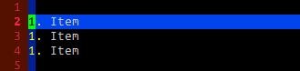

カーソル位置の数字をインクリメント／デクリメントする
----

{: .center }

数字を表すテキストにカーソルを合わせて <kbd>CTRL-A</kbd> と入力すると、その数値をインクリメントする（数字を1つ増やす）ことができます。
逆に <kbd>CTRL-X</kbd> でデクリメントする（数字を1つ減らす）ことができます。

- <kbd>CTRL-A</kbd>: カーソル位置の数値をインクリメントする
- <kbd>CTRL-X</kbd>: カーソル位置の数値をデクリメントする

数値のプレフィックスに `0` が付いていれば 8 進数、`0x` や `0X` が付いていれば 16 進数とみなしてインクリメント／デクリメントしてくれます。
例えば、10進数、8進数、16進数と思われる数値は、それぞれ下記のようにインクリメントされます。

- `17` → `18`
- `017` → `020`
- `0xFF` → `0x100`

<kbd>CTRL-A</kbd>、<kbd>CTRL-X</kbd> コマンドのプレフィックスとして数値を与える（先に数値を入力する）と、その数値分だけ足したり引いたりすることができます。

選択範囲の数字をまとめてインクリメント／デクリメントする
---

<kbd>SHIFT-V</kbd> や <kbd>CTRL-V</kbd> のビジュアルモードで選択した範囲にある数値をまとめてインクリメントすることもできます。
下記のデモでは、<kbd>SHIFT-V</kbd> で複数行を選択してから、<kbd>CTRL-A</kbd> で複数の数値をまとめてインクリメントしています。

{: .center }

応用例として、<kbd>CTRL-A</kbd> と入力する前に <kbd>g</kbd> を入力しておくと、次のようにそれぞれの数値に足される数自体がインクリメントされていきます。
連番からなる数値の羅列を作りたいときに便利です。

{: .center }

