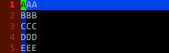

{: .center }

行末の改行を削除して次の行と連結するには下記のコマンドを使用します。

- <kbd>J</kbd>: スペースを1文字いれて連結する。
- <kbd>gJ</kbd>: スペースを入れずに連結する。

ビジュアルモード (<kbd>SHIFT-V</kbd>) で複数行を選択してから上記を入力すると、複数の行をまとめて連結することができます。

{: .center }

3行以上の行をスペースを入れずに連結したい場合は、ビジュアルモードで複数行を選択した状態で <kbd>gJ</kbd> とするか、一行だけ <kbd>gJ</kbd> で連結しておいて、残りの行を <kbd>.</kbd> の連打で連結するのがお手軽です。

