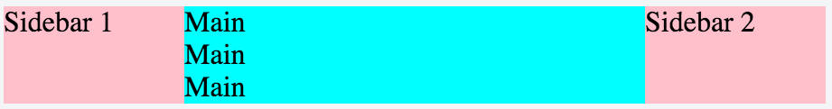
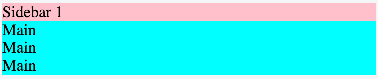

フレキシブルボックスレイアウト機能を利用すると、下記の様な段組レイアウトを簡単に作成することができます。



### HTML

```html
<div id="container">
  <div id="sidebar1">Sidebar 1</div>
  <div id="main">Main<br>Main<br>Main</div>
  <div id="sidebar2">Sidebar 2</div>
</div>
```

### CSS

```css
#container {
  /* フレキシブルボックスレイアウトによる段組 */
  display: flex;
  display: -webkit-flex;
  display: -webkit-box;
  display: -moz-box;
}

#sidebar1, #sidebar2 {
  width: 100px;
  background: pink;
}

#main {
  background: cyan;
  /* 画面幅が広い時はこの要素の横幅を拡張する */
  flex-grow: 1;
  -webkit-flex-grow: 1;
  -webkit-box-flex: 1;
  -moz-box-flex: 1;
}
```

* [（コラム）フレキシブルボックスの旧式の定義方法](flexible-box-old.html)

さらに、メディアクエリを利用して、画面幅が一定サイズ以下になったときに、このフレキシブルボックスレイアウトを解除することができます。
例えば、スマートフォンなどで表示する場合に、サイドバーを縦に並べたり、省略してもよいサイドバーを非表示にしたりできます。
下記の例では、画面幅が `400px` 以下になった場合にフレキシブルボックスレイアウトを解除し、`sidebar1` を横幅いっぱいで表示し、`sidebar2` を非表示にしています。



### CSS

```css
/*
 * レスポンシブデザイン対応。
 * 幅が狭い場合は sidebar1 を横幅いっぱいに表示する。
 * sidebar2 は非表示にする。
 */
@media screen and (max-width: 400px) {
  #container {
    display: block;
  }
  #sidebar1 {
    width: auto;
  }
  #sidebar2 {
    display: none;
  }
}
```

ソースコード
----

* https://jsfiddle.net/maku77/h5vzwzxt/

