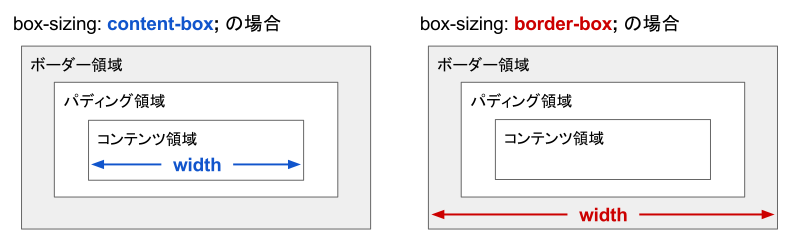

content-box 指定と border-box 指定
----

下記の図は、HTML 要素の `width` の値が、具体的にどの部分の幅であるかを示しています。
ここでは簡略化のために `width` の例を示していますが、`height` も同様です。

{: .center }

`box-sizing` プロパティのデフォルト値は `content-box` になっており、簡単に言うと、テキストの描画部分の領域のことを表しています。
デフォルトの状態で、`width: 300px;` というスタイル指定を行った場合、その `300px` にはパディング (padding) 部分や、ボーダー (border) 部分のサイズは含まれません。
つまり、`width: 300px;` と指定された要素が実際に描画されるときには、それよりも大きなサイズで描画されることになります。

ボーダー領域まで含めたサイズを、`width` プロパティや `height` プロパティで指定したいときは、`box-sizing` プロパティの値を `border-box` に指定します。

~~~ css
.layout-box {
  /* width と height にボーダー領域まで含める */
  box-sizing: border-box;
  -moz-box-sizing: border-box;
  -webkit-box-sizing: border-box;
}
~~~

実際に試してみる
----

下記のデモは、`box-sizing` プロパティの値を `content-box`（デフォルト）と `border-box` に設定したときの表示の違いを示しています。
分かりやすくするために、ボーダー領域は青色で表示しています。
パディング領域だけに色をつけることはできないため、テキストの周りの微妙な隙間がパディング領域だと思ってください。

### デモ

<iframe class="xHtmlDemo" src="box-sizing-demo.html"></iframe>
<a target="_blank" href="box-sizing-demo.html">デモページを開く</a>

どちらも、`width` は `300px` としていますが、`box-sizing: border-box;` と指定した場合は、ボーダー領域まで `width` に含めて計算するようになるため、実際の表示も若干小さくなります。

#### CSS

~~~ css
div {
  width: 300px;
  height: 100px;
  padding: 10px;
  border: solid 10px #59f;
  background: #ddd;
  margin: 20px;
}
div.content-box {
  box-sizing: content-box;
}
div.border-box {
  box-sizing: border-box;
}
~~~

#### HTML

~~~ html

  box-sizing: <b>content-box</b>;

  box-sizing: <b>border-box</b>;

~~~

ちなみに margin に関しては、width の計算に含まれることはありません。
margin はあくまで<b>要素の外側</b>のマージンだと考えましょう。

段組レイアウトでは box-sizing: border-box が便利
----

２つ以上のボックスを横に並べて段組レイアウトを行う場合、デフォルトの `box-sizing` アルゴリズム (`content-box`) を使用していると、`width` 値の指定が非常に複雑になります（パディングやボーダーのサイズを考慮して `width` 値を調整しなければならないため）。
このような場合、横に並べるボックス要素に、`box-sizing: border-box;` の指定を行っておくと、直感的な `width` 指定を行うことができます。

### デモ

<iframe class="xHtmlDemo" src="box-sizing-demo2.html"></iframe>
<a target="_blank" href="box-sizing-demo2.html">デモページを開く</a>

#### CSS

~~~ css
.container {
  background: blue;
  height: 95vh;
}
.left {
  box-sizing: border-box;
  float: left;
  width: 200px;
  height: 100%;
  padding: 10px;
  background: #f9c;
}
.right {
  box-sizing: border-box;
  margin-left: 200px;
  height: 100%;
  padding: 10px;
  background: #9fa;
}
~~~

#### HTML

~~~ html

  
Left (200px)

  
Right

~~~

