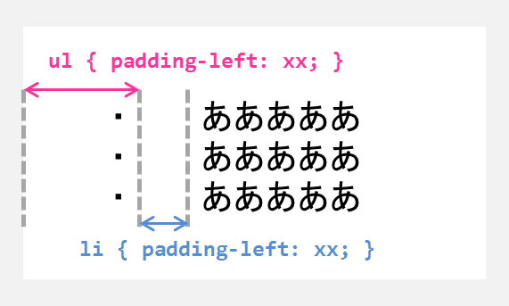

ul 要素と li 要素の padding-left
----

{: .center }

この図は、`ul` 要素（あるいは `ol` 要素）の `padding-left` の値と、`li` 要素の `padding-left` の値がどの領域のサイズとして反映されるかを示しています。

特に気をつけなければいけないのは、`ul` 要素の `padding-left` 値は、`li` 要素の描画領域の左端までのサイズになるというところです。
言い換えると、リストマーカー（`・`など）の右端までのサイズです。
つまり、`ul` 要素の `padding-left` の値は、リストマーカーを含んだサイズであることを意識して設定する必要があります。
Chrome では `ul` 要素の `padding-left` の規定値は 40px になっているようです。

一方で、`li` 要素の `padding-left` は、リストマーカーの右端から、テキストの左端までの隙間のサイズを表します。
こちらの値は 0 になっていても、特におかしな表示にはなりません。

ul のインデント設定は padding-left で行うのが基本
----

下記は、`ul` 要素の `padding-left` だけを設定した場合の表示デモです（その他の `margin` 設定や `padding` 設定は 0 です）。
入れ子になった `ul` 要素も、それっぽくインデントされていることがわかります。
これが、`ul` 要素や `ol` 要素に対してインデントサイズを指定するときの基本的な方法です。

#### 表示デモ 1

<iframe class="maku-htmlDemo" src="list-margin-demo1.html"></iframe>

表示デモの中の外側の矩形は、`ul` 要素を配置する親要素の描画領域を示しています。
`ul` 要素の描画領域はピンク背景、`li` 要素の描画領域は下線を引くことで、それぞれの要素の位置関係が分かるようにしています。
ここでは `ul { padding-left: 3em; }` と指定していますが、このサイズは、上記の表示では、ピンク領域の左端 ～ テキストの下線が始まるところまでのサイズとして表れています。

サイズの単位として <code>em</code> を使うようにすれば、<code>ul</code> 要素内のフォントサイズを基準にして指定することができます。

#### 表示デモ 2

<iframe class="maku-htmlDemo" src="list-margin-demo2.html"></iframe>

`ul` 要素の `padding-left` を 0 にしてしまうと、上記のように入れ子要素のインデントがなくなり、さらに、リストマーカーを表示する余裕もないので、親要素をはみ出してリストマーカーが表示されてしまいます。
`ul` 要素の `padding-left` には、余裕を持ったサイズを指定しなければいけないということです。

#### 表示デモ 3

<iframe class="maku-htmlDemo" src="list-margin-demo3.html"></iframe>

上記は、`padding-left` の代わりに `margin-left` を設定した場合の表示デモですが、この方法でもうまくインデントされているかのように見えます。
ただし、`margin` プロパティの値は、他の要素と並べて配置した時に、それらの `margin` と相殺される性質を持っています。
思わぬ表示位置のずれを防ぐためにも、**ul (ol) の入れ子要素のインデントサイズ指定には `padding-left` だけを使う**ことをおススメします。

ちなみに `padding-left` と `margin-left` を両方設定すると、次のようにインデント幅がものすごく大きくなったように見えます。

#### 表示デモ 4

<iframe class="maku-htmlDemo" src="list-margin-demo4.html"></iframe>

li の padding-left は 0 で OK
----

`li` 要素の `padding-left` プロパティでは、リストマーカーの右端からテキストの先頭までの距離を設定します。

次の例では、各 `li` 要素の `padding-left` の値を少しずつ増やしながら表示しています。

#### 表示デモ 5

<iframe class="maku-htmlDemo" src="list-margin-demo5.html"></iframe>

入れ子になった `ul` 要素は `li` 要素の子要素として配置されるため、`li` 要素の `padding-left` を大きくすると、その下の `ul` 要素自体のインデント幅が大きくなったかのように見えます。

#### 表示デモ 6

<iframe class="maku-htmlDemo" src="list-margin-demo6.html"></iframe>

間違えがちですが、<code>ul</code> 要素の直下に <code>ul</code> を配置することはできません。<code>ul</code> 要素の直下には、必ず <code>li</code> 要素を配置する必要があります。

入れ子になった（2階層目以降の）ul のインデントだけ小さくする
----

1階層目の ul のインデントだけ小さくしたいとか、2階層目以降の ul のインデントだけ小さくしたいという場合は、例えば以下のように設定すればよいでしょう。

~~~ css
ul, ol {
  padding-left: 3em;
}
li > ul, li > ol {
  /* 2階層目以降はインデントを小さく */
  padding-left: 1em;
}
~~~

`ul` 要素の親要素が `li` であることを示すセレクタ (`li > ul`) を使用することで、2階層目以降の `ul` 要素に対するスタイル設定を行うことができます。

#### 表示デモ 7

<iframe class="maku-htmlDemo" src="list-margin-demo7.html"></iframe>

応用：画面幅が狭い時にはインデント幅も小さくする
----

リストのインデントを大きくしすぎると、ブラウザの画面サイズが小さいとき（スマホで表示した場合など）に、表示できる文字数が少なくなってしまいます。
このような問題を避けるためには、メディアクエリを使用して、画面サイズごとにインデントサイズを変更するようにします。

#### CSS の例

~~~ css
ul, ol {
  padding-left: 2em;
}
li > ul, li > ol {
  padding-left: 1em;
}

/* スクリーンサイズが大きいときはインデントも大きく */
@media (min-width: 30rem) {
  ul, ol {
    padding-left: 3em;
  }
  li > ul, li > ol {
    padding-left: 2em;
  }
}
~~~

下記の例では、ブラウザの画面サイズが小さいときに、リストのインデント幅も小さくなるように設定しています（フレームの右下をドラッグしたり、<kbd>Ctrl-+</kbd>でフォントサイズを変更したりすると、インデントサイズが変化することを確認できます）。

#### 表示デモ 8

<iframe class="maku-htmlDemo" src="list-margin-demo8.html"></iframe>

まとめ
----

* ul (ol) 要素を入れ子にしたときのインデントサイズは ul (ol) 要素の **padding-left** で設定する
* 2階層目以降の ul (ol) 要素のインデントサイズだけ変更したい場合は **li &gt; ul** というセレクタを使用する
* margin-left は使用しない
* padding-left の値のサイズとしては **em** を使用するのがおススメ

