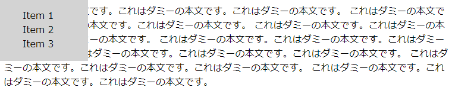
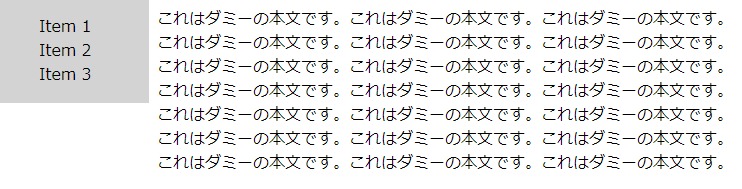

メニュー全体を画面左上に固定
----

{: .center }

<a target="_blank" href="position-fixed-menu-sample1.html">デモページを表示</a>

まずは、HTML で簡単なメニュー要素を用意します。

#### html

```html
<nav class="menu">
  <ul>
    <li>Item 1
    <li>Item 2
    <li>Item 3
  </ul>
</nav>
```

メニュー全体を囲む要素に `position: fixed;` というスタイルを指定することで、画面上の特定の座標に表示位置を固定します。
実際の表示位置は、`top`、`bottom`、`left`、`right` などのプロパティで指定します。

#### css

```css
.menu {
  position: fixed;
  top: 0px;
  left: 0px;
  width: 150px;
  background: lightgray;
}
.menu li {
  list-style: none;
}
```

<div class="note">
<code>position: fixed;</code> の代わりに <code>position: absolute;</code> と指定すると、画面上の左上ではなく、ページ全体の左上を基準とした固定位置で要素を配置することができます（画面スクロールするとその要素も一緒にスクロールします）。
</div>


本文がメニューの後ろに隠れないようにする
----

{: .center }

<a target="_blank" href="position-fixed-menu-sample2.html">デモページを表示</a>

上記のスタイル指定により、メニュー要素を画面左上に表示することができるようになりました。
しかし、そのままだと、メインコンテンツ（本文）のテキストがメニューの後ろに隠れてしまいます。
メインコンテンツが隠れないようにするには、メインコンテンツの左側にメニューと同じ幅のマージンを入れます。

#### HTML 抜粋

~~~ html
<main>
  <p>
    これはダミーの本文です。これはダミーの本文です。これはダミーの本文です。
    ...
  </p>
</main>

<nav class="menu">
  <ul>
    <li>Item 1
    <li>Item 2
    <li>Item 3
  </ul>
</nav>
~~~

#### CSS

~~~ css
main {
  display: block;
  margin-left: 150px;
}
.menu {
  position: fixed;
  top: 0px;
  left: 0px;
  width: 150px;
  background: lightgray;
}
.menu li {
  list-style: none;
}
~~~

<div class="note">
IE では、<code>main</code> 要素のデフォルト設定が <code>display: block;</code> になっていないため、明示的に CSS で指定してやる必要があります。これを指定しておかないと、<code>margin-left</code> の設定が効きません。
</div>

可能であれば、CSS ファイルを直接記述するのではなく、SASS などを使用して共通の横幅を変数で指定してしまうのがよいですね。

#### SASS の場合（メニューの幅を変数で定義）

~~~ scss
$menu_width: 150px;

main {
  display: block;
  margin-left: $menu_width;
}
.menu {
  position: fixed;
  top: 0px;
  left: 0px;
  width: $menu_width;
  background: lightgray;
}
.menu li {
  list-style: none;
}
~~~

