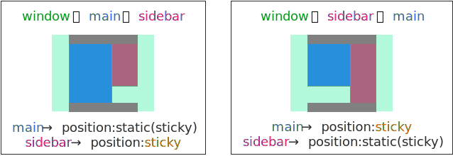
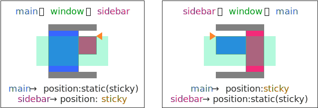
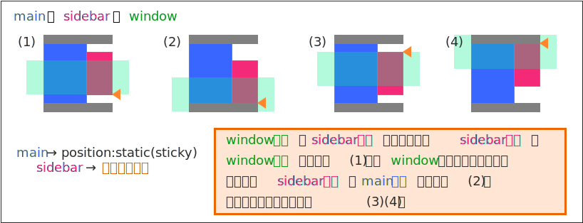
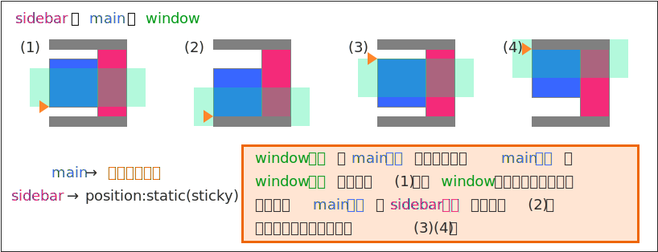
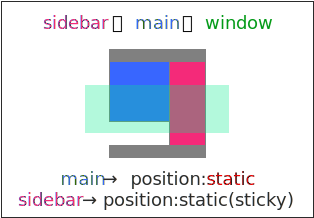

ページをスクロールしたときに、メニュー（サイドバー）のスクロールを画面上端あたりまでに制限する方法には、CSS の sticky position を使う方法や、JavaScript を使用する方法があります。

position: sticky を使ってサイドバーのスクロールを抑制する方法
----

下記のデモページをスクロールすると、最初はメニュー（サイドバー部分）も一緒にスクロールしますが、ある位置を超えるとメニュー位置が固定されます。
このやり方は、ページ上部のヘッダに大きなアイキャッチ画像などを入れているサイトなどでたまに見かけます。

#### デモ（<a target="_blank" href="scroll-and-fix-demo1.html">別ウィンドウで開く</a>）

<iframe class="xHtmlDemo" src="scroll-and-fix-demo1.html"></iframe>

CSS の [Sticky positioning](https://developer.mozilla.org/ja/docs/web/css/position#Sticky_positioning) に対応したブラウザであれば、次のようにして要素のスクロールを簡単に制限することができます。

~~~ css
.yourElement {
    position: -webkit-sticky;  /* for Safari */
    position: sticky;
    top: 0px;  /* 画面上端オフセット */
}
~~~

`position: sticky;` を指定すると、デフォルトでは `position: relative;` と同様な振る舞いをしますが、その要素が画面上の指定した位置（上記の例では画面上端から 0px）に来ると、要素の位置が固定されます。
この振る舞いは、親要素の表示範囲内で効いてくるため、画面下端のフッター領域が表示されるタイミングでは、メニュー領域はちゃんと上にスクロールされて消えていきます（うまくできています）。

下記のコードは、上記のデモページを構成している HTML と CSS の抜粋です。

#### HTML 抜粋

~~~ html

  

    本文 本文 本文 本文 本文 ...
  

  

    

      メニュー メニュー メニュー メニュー ...
    

  

~~~

#### CSS 抜粋

~~~ css
/* ヘッダー／フッター部分 */
#headerArea, #footerArea {
  height: 100px;
  background: gray;
}

/* 本文領域とサイドバー領域を含むコンテナ */
#container {
  /* フレキシブルボックスレイアウトによる段組 */
  display: flex;
  display: -webkit-flex;
  display: -webkit-box;
  display: -moz-box;
}

/* 左側の本文領域 */
#mainArea {
  background: lightgray;

  /* 画面幅が広い時はこの要素の横幅を拡張する */
  flex-grow: 1;
  -webkit-flex-grow: 1;
  -webkit-box-flex: 1;
  -moz-box-flex: 1;
}

/* 右側のサイドバー領域 */
#sidebarArea {
  width: 100px;
  background: yellow;
}

/* サイドバー内のメニュー ★ここがポイント */
#sidebar {
  background: magenta;

  /* Sticky positioning の設定 */
  position: -webkit-sticky;  /* for Safari */
  position: sticky;
  top: 0px;  /* 画面上端オフセット */
}
~~~

Sticky positioning は、主にアルファベット順や五十音順のリストの見出しに使用されます（<a target="_blank" href="https://developer.mozilla.org/ja/docs/web/css/position#Sticky_positioning">こちらの例</a>を見るとわかりやすいです）。
サイドバーなどの上端を固定するような用途で使用すると、サイドバーが長くなった場合に、なかなかスクロールが始まらないという問題が発生します。
**Sticky positioning によりサイドバーを上端固定する場合は、短いサイドバーに限る**ようにしましょう。

JavaScript を使ってサイドバーのスクロールを抑制する方法
----

JavaScript でスクロールイベントをハンドルして、メニュー要素の位置をうまく制御するという方法もあります。

#### デモ（<a target="_blank" href="scroll-and-fix-demo2.html">別ウィンドウで開く</a>）

<iframe class="xHtmlDemo" src="scroll-and-fix-demo2.html"></iframe>

この例では、メニューが指定した位置までスクロールしたら、`position: fixed` プロパティを設定して、位置を固定するようにしています。

#### HTML 抜粋

~~~ html

  

    本文 本文 本文 本文 本文 ...
  

  

    

      メニュー メニュー メニュー メニュー ...
    

  

~~~

#### CSS 抜粋

~~~ css
/* ヘッダー／フッター部分 */
#headerArea, #footerArea {
  height: 100px;
  background: gray;
}

/* floating レイアウトの解除用 */
#container::after {
  display: block;
  content: "";
  clear: both;
}

/* 左側の本文領域 */
#mainArea {
  float: left;
  width: calc(100% - 150px);
  background: lightgray;
}

/* 右側のサイドバー領域 */
#sidebarArea {
  float: left;
}

/* サイドバー内のメニュー */
#sidebar {
  /*
   * position: fixed; にした瞬間に、親要素 (#sidebarArea) から
   * 切り離されるので、親要素ではなく、この要素に width プロパティを
   * 指定しておく必要がある。
   */
  width: 150px;
  background: magenta;
}

/* ある位置までスクロールしたらサイドバーの位置指定を fixed にする */
.sidebar-fixed {
  position: fixed;
  top: 30px;
}
~~~

#### JavaScript 抜粋（jQuery を使用）

~~~ javascript
$(function() {
  var MARGIN_TOP = 30;  // どの位置で固定するか（閾値）
  var sidebar = $('#sidebar');
  var sidebar_top = sidebar.offset().top;  // サイドバーの初期位置

  $(window).scroll(function() {
    if ($(window).scrollTop() + MARGIN_TOP > sidebar_top) {
      sidebar.addClass('sidebar-fixed');
    } else {
      sidebar.removeClass('sidebar-fixed');
    }
  });
});
~~~

サイドバーを画面上端に固定するためだけに JavaScript を使用するのは、パフォーマンスの観点などからあまりお勧めはできません。
要素下端の処理も複雑なので（上記の例ではちゃんと処理していません）、できるだけ CSS の Sticky positioning を使う方法を採用した方がよいでしょう。

ただし、Sticky positioning を使う方法にせよ、JavaScript を使う方法にせよ、サイドバーを単純に上端に固定してしまうと、長いメニューの末尾が表示できなくってしまうという問題を解決できません。
いろいろな表示パターンでうまい感じにサイドバーの位置制御を行うには、次で説明するような場合分け処理が必要になります。

すべてのパターンで空白領域が少なくなるように制御する
----

本文領域の高さ (main) やサイドバーの高さ (sidebar)、ブラウザの表示領域（window）の高さの組み合わせは、次のように 6 パターンに分類できます。

1. window の高さ ＞ main の高さ ＞ sidebar の高さ
2. window の高さ ＞ sidebar の高さ ＞ main の高さ
3. main の高さ ＞ window の高さ ＞ sidebar の高さ
4. sidebar の高さ ＞ window の高さ ＞ main の高さ
5. main の高さ ＞ sidebar の高さ ＞ window の高さ
6. sidebar の高さ ＞ main の高さ ＞ window の高さ

ページをスクロールさせたときに、できるだけページ末尾の空白を表示しないようにするには、それぞれのパターンで異なる処理を行う必要があります。
以下、順番に詳しく見ていきます。

### 本文領域とサイドバーが画面内にすべて収まる場合

{: .center }

画面内にすべてのコンテンツ（本文とサイドバー）が表示できる場合は、特にサイドバーの位置調整などを行う必要はありません。
デフォルトのポジション指定である `position: static` のままで大丈夫です。
ただし、フッターのサイズが大きい場合は、main と sidebar いずれか短い方に、`position: sticky` を指定しておくのが望ましいでしょう。

### 本文領域、あるいはサイドバーのどちらかが画面内に収まる場合

{: .center }

本文、あるいは、サイドバーがウィンドウ内にすべて表示できるサイズの場合、サイズの小さい方の上端を `position: sticky` で固定します。
こうしておけば、ページをスクロールしている最中に、小さい方のコンテンツはすべて表示しつづけることができます。

### サイドバーが本文より小さいが、画面内に収まらない場合

{: .center }

サイドバーが、ウィンドウ内に収まらない場合は、少し複雑な処理が必要になります。
必要に応じて、下方向にスクロールしているときは画面下端にサイドバーを配置し、上方向にスクロールしているときは画面上端にサイドバーを配置するようにします。
こうすれば、画面スクロール時に必ずサイドバーをスクロールさせることができ、しかも、無駄な空白領域が表示されてしまうのを防ぐことができます。

### 本文がサイドバーより小さいが、画面内に収まらない場合

{: .center }

ひとつ前のパターンとほぼ同様ですが、本文がサイドバーのサイズより小さいパターンです。
必要に応じて、スクロール時に本文領域の位置を調整します。

本文領域まで位置制御しなくてもよい（サイドバーだけ位置制御できればよい）と考えるのであれば、本文領域は単純に `position: static` で表示しておけばよいでしょう。

{: .center }

他のパターンでは、本文領域は `position: static` の代わりに `position: sticky` を指定しておいても問題ありませんが、この場合だけは必ず `position: static` を指定しないといけないことに注意してください。
そうしないと、スクロール時に本文領域の上端部分しか表示されなくなってしまいます。

### デモ（<a target="_blank" href="scroll-and-fix-demo3.html">別ウィンドウで開く</a>）

<iframe class="xHtmlDemo" src="scroll-and-fix-demo3.html"></iframe>

### 実装

ここでは、単純化のため、本文領域 (main) に関しては位置制御を行わず (`position: static`)、サイドバーのみ位置制御を行うようにしています。

#### HTML 抜粋

~~~ html

  

    

      
本文

      
本文

      
本文

      ...
    

  

  

    

      
メニュー

      
メニュー

      
メニュー

      ...
    

  

~~~

#### CSS 抜粋

~~~ css
/* 本文領域とサイドバー領域を含むコンテナ */
#container {
  /* フレキシブルボックスレイアウトによる段組 */
  display: flex;
  display: -webkit-flex;
  display: -webkit-box;
  display: -moz-box;
}

/* 左側の本文領域 */
#mainArea {
  position: relative;
  background: dodgerblue;

  /* 画面幅が広い時はこの要素の横幅を拡張する */
  flex-grow: 1;
  -webkit-flex-grow: 1;
  -webkit-box-flex: 1;
  -moz-box-flex: 1;
}

/* 本文の実体 */
#main {
  position: static;
  padding: 10px;
}

/* 右側のサイドバー領域 */
#sidebarArea {
  position: relative;
  width: 100px;
  background: magenta;
}

/* サイドバーの実体 */
#sidebar {
  padding: 10px;
  width: 100%;
  /* デフォルトで Sticky positioning */
  position: -webkit-sticky;
  position: sticky;
  top: 0;
}
~~~

#### JavaScript 抜粋

~~~ javascript
$(function () {
  var $window = $(window);
  var $container = $('#container');
  var $main = $('#main');
  var $sidebar = $('#sidebar');
  var windowHeight, containerHeight, sidebarHeight;

  $window.on('resize', init);
  init();

  // 高さ情報の更新、イベントハンドラの登録・解除など
  function init() {
    var mainHeight = $main.outerHeight(true);
    windowHeight = $window.height();
    containerHeight = $container.outerHeight(true);
    sidebarHeight = $sidebar.outerHeight(true);
    $window.off('scroll', adjustSidebar); // スクロールハンドラを一旦解除

    if ((mainHeight > sidebarHeight) && (sidebarHeight > windowHeight)) {
      $window.on('scroll', adjustSidebar);  // 動的なサイドバー制御
      adjustSidebar();  // すぐに一度位置調整
    } else {
      posSticky();
    }
  }

  function posSticky() {
    $sidebar.css({ 'position' : 'sticky', 'top' : 0 });
  }

  function posAbsolute(offset) {
    $sidebar.css({ 'position' : 'absolute', 'top' : offset });
  }

  // サイドバーの位置を調整する処理
  function adjustSidebar() {
    var windowTop = window.pageYOffset;
    var windowBottom = windowTop + windowHeight;
    var containerTop = $container.offset().top;
    var containerBottom = containerTop + containerHeight;
    var sidebarTop = $sidebar.offset().top;
    var sidebarBottom = sidebarTop + sidebarHeight;

    if (windowTop < containerTop) { // 上への行き過ぎ防止
      posAbsolute(0);
    } else if (windowBottom > containerBottom) { // 下への行き過ぎ防止
      posAbsolute(containerHeight - sidebarHeight);
    } else if (windowTop < sidebarTop) { // 上スクロール時の上端固定
      posAbsolute(windowTop - containerTop);
    } else if (windowBottom > sidebarBottom) { // 下スクロール時の下端固定
      posAbsolute(windowBottom - containerTop - sidebarHeight);
    }
    // それ以外は何もせず、自然にスクロールするのにまかせる
  }
});
~~~

