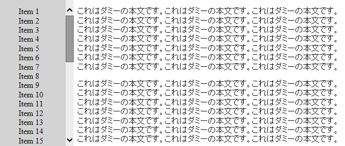
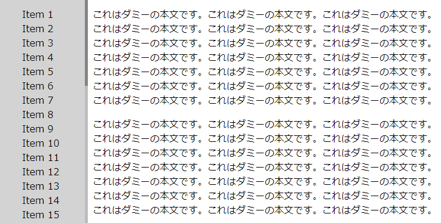

サイドバー単独でスクロールできるようにする
----

{: .center }

<a target="_blank" href="scroll-menu-sample1.html">デモページを開く</a>

サイドバーにメニューを表示しているときに、例えばその高さ (`height`) を `100vh` に設定すると、画面の高さと同じ高さでメニューが表示されます。
サイドバーの高さを固定すると、画面外に溢れるメニュー項目は見えなくなってしまいます。
このようなケースでは、`overflow-y: scroll;` を設定すると、スクロールバーを表示して、メニューの領域を単独でスクロールすることができるようになります。

#### HTML 抜粋

~~~ html
<main>
  

    これはダミーの本文です。これはダミーの本文です。これはダミーの本文です。
    これはダミーの本文です。これはダミーの本文です。これはダミーの本文です。
    ...
  

</main>

<nav class="menu">
  <ul>
    <li>Item 1 <li>Item 2 <li>Item 3 <li>Item 4 <li>Item 5
    <li>Item 6 <li>Item 7 <li>Item 8 <li>Item 9 <li>Item 10
    ...
  </ul>
</nav>
~~~

#### CSS 抜粋

~~~ css
main {
  display: block;  /* for IE */
  margin-left: 150px;
}

.menu {
  position: fixed;
  top: 0px;
  left: 0px;
  width: 150px;
  height: 100vh;
  background: lightgray;

  /* 縦方向のスクロールバーを表示 */
  overflow-y: scroll;

  /* IE などのスクロールバーの色設定 */
  scrollbar-face-color: #999;
  scrollbar-track-color: #eee;

  /* スマホ用の慣性スクロール */
  -webkit-overflow-scrolling: touch;
}
~~~

細くてクールなスクロールバーを表示する
----

{: .center }

<a target="_blank" href="scroll-menu-sample2.html">デモページを開く</a>

Chrome ブラウザなどでは、下記のようなスタイル指定を行うことにより、細くてかっこいいスクロールバーを表示することができます。

#### CSS 抜粋

~~~ css
/* Chrome などでは細めのきれいなスクロールバーを表示 */
.menu::-webkit-scrollbar {
  width: 5px;
}
.menu::-webkit-scrollbar-thumb {
  background: rgba(0, 0, 0, 0.3);
}
.menu::-webkit-scrollbar-track {
  background: rgba(0, 0, 0, 0.1);
}
~~~

