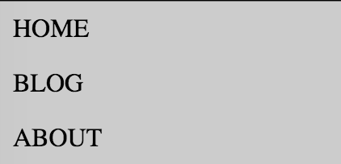
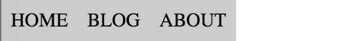

HTML 要素としては同じ li 要素でも、CSS のスタイル記述を工夫することで、縦並びの表示と横並びの表示を切り替えることができます。
下記の例では、メディアクエリを使用して、画面幅の広い場合はメニューアイテムを横向きに並べています。

表示例
----

{: .center }

{: .center }

ソースコード
----

#### html

```html
<nav class="menu">
  <ul>
    <li>Home
    <li>Blog
    <li>About
  </ul>
</nav>
```

#### css

```css
/* normalize */
* {
  margin: 0;
  padding: 0;
}

.menu li {
  display: list-item;  /* 縦に並べる */
  list-style-type: none;
  text-transform: uppercase;
  padding: 0.5em;
  background: #ccc;
}

/* 横幅が広いとき */
@media (min-width: 640px) {
  .menu li {
    display: inline-block;  /* 横に並べる */
  }
}
```

