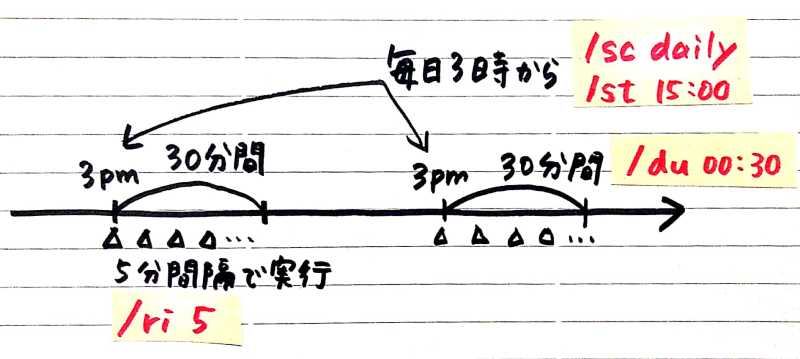
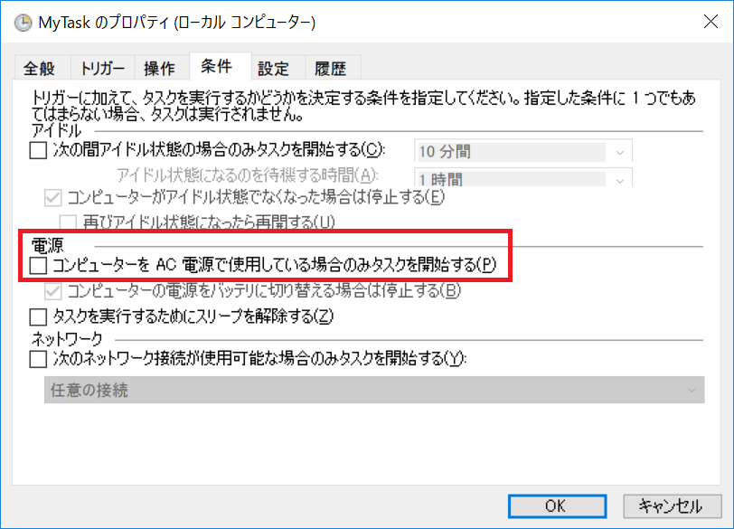

タスクスケジューラと schtasks コマンド
----

Windows にはタスクスケジューラ (task scheduler) サービスが標準搭載されており、ここに **`schtasks`** コマンドでタスクを登録することで、指定された時間や頻度で、任意のコマンドを自動実行してくれます（以降、タスクスケジューラに登録するタスクのことを、「スケジュールタスク」あるいは単に「タスク」と呼びます。

`schtasks` コマンドでは、主に下記の 6 種類のオプションを利用してスケジュールタスクの管理を行います。
これらのコマンド一覧は `schtasks /?` で確認できます。

- **`schtasks /create`**: スケジュールタスクを作成します。
- **`schtasks /delete`**: 登録されているスケジュールタスクを削除します。
- **`schtasks /query`**: 登録されているスケジュールタスクの一覧を表示します。
- **`schtasks /change`**: 登録されているスケジュールタスクの設定を変更します。有効化、無効化の切り替えを行うこともできます。
- **`schtasks /run`**: 登録されているスケジュールタスクを手動で実行します。
- **`schtasks /end`**: 実行中のスケジュールタスクを強制終了します。


スケジュールタスクの作成 (schtasks /create)
----

スケジュールタスクを作成するときは、次のような構文で `schtasks /create` コマンドを実行します。

```
schtasks /create /tn <タスク名> /tr <実行するコマンド> 【実行タイミング】【開始日時および終了日時】
```

【実行タイミング】の指定方法と、【開始日時および終了日時】の指定方法は下記に示した例を参考にしてください。
【実行タイミング】の指定は必須ですが、【開始日時および終了日時】はオプショナルです。
より詳細な指定方法は、`schtasks /create /?` で確認することができます。

### タスクの【実行タイミング】を指定する

タスクの実行タイミングは、**`/sc`** オプションと、**`/mo`** オプション（あるいは `/m` や `/d` など）で指定します。
**`/sc` オプションで大まかなスケジュールの種類（minute、hourly、daily、weekly、onstart など）を指定**し、必要があれば、**その後ろに続けて `/mo` オプションなどで詳細パラメータを指定**します。

例えば、次のように `/sc once` で実行すると、タスクを作成して直ちに一度だけ実行します。
単純にコマンドを実行した場合（`c:\sample.bat` を直接実行した場合）との違いは、スケジュールタスクとして登録された状態になることです。
将来このタスク名を使って、実行のスケジューリングを行うことができます。

```
schtasks /create /tn "MyTask" /tr c:\sample.bat /sc once
```

下記に実行タイミングの指定方法の例です。
`/sc` よりも前の部分は共通なので、`/sc` オプション以降の指定方法だけを示します。

| 実行タイミングの指定方法 | 意味 |
| ---- | ---- |
| `/sc once` | 直ちに一度だけ実行（繰り返しなし） |
| `/sc once /m 7 /d 10` | 7 月 10 日に一度だけ実行（繰り返しなし） |
| `/sc once /st 21:30` | 今日の 21 時 30 分に一度だけ実行（繰り返しなし） |
| `/sc once /sd 2019/12/31 /st 23:55` | 2019 年 12 月 31 日の 23 時 55 分に一度だけ実行（繰り返しなし） |
| `/sc onstart` | システム起動時に実行 |
| `/sc onstart /delay 5:00` | システム起動後、5 分後に実行。`/delay MM:SS` の指定は他のオプションと時刻の単位が違うことに注意 |
| `/sc onlogon` | ユーザのログオン時に実行 |
| `/sc onlogon /delay 5:00` | ユーザのログオン後、5 分後に実行。`/delay MM:SS` の指定は他のオプションと時刻の単位が違うことに注意 |
| `/sc onidle /i 10` | 10 分以上アイドル状態（無操作）のときに実行 |
| `/sc minute` | 毎分実行（`/mo 1` を指定した場合と同じ）。システム時刻の分の位が更新するときに起動するので、初回実行までの待機時間は 60 秒より短くなる |
| `/sc minute /mo 15` | 15 分ごとに実行。初回実行までの待機時間はちょうど 15 分 |
| `/sc hourly` | 毎時実行（`/mo 1` を指定した場合と同じ）。開始時刻はタスク作成時刻になる。初回実行までの待機時間は 60 分より短くなる |
| `/sc hourly /mo 5` | 5 時間ごとに実行。タスク作成時間からカウントされるので、初回実行までの待機時間はちょうど 5 時間 |
| `/sc daily` | 毎日実行。（`/mo 1` を指定した場合と同じ）。開始時刻はタスク作成時刻になる。初回実行までの待機時間はちょうど 24 時間 |
| `/sc daily /st 21:00` | 毎日 21:00 に実行。初回実行までの待機時間は 24 時間より短くなる |
| `/sc daily /mo 3` | 3 日ごとにタスク作成時の時刻に実行。初回実行までの待機時間はちょうど 72 時間 |
| `/sc daily /mo 3 /st 00:00 ` | 3 日ごとに午前 0 時に実行。初回実行までの待機時間は 72 時間よりも短くなる |
| `/sc weekly` |  毎週（月曜日に）実行（`/mo 1` あるいは `/d mon` を指定した場合と同じ）。開始時刻はタスク作成時刻になる。初回は次の月曜日に実行 |
| `/sc weekly /mo 6` | 6 週ごとに実行。初回は 6 週間後に実行 |
| `/sc weekly /d mon,wed` | 毎週月曜日と水曜日に実行。開始時刻はタスク作成時刻になる |
| `/sc weekly /d *` | すべての曜日で実行（毎日ということ） |
| `/sc monthly` | 毎月 1 日に実行。初回は翌月の 1 日に実行 |
| `/sc monthly /mo first` | 毎月 1 週目に実行 |
| `/sc monthly /mo second` | 毎月 2 週目に実行 |
| `/sc monthly /mo last` | 毎月最終週に実行 |
| `/sc monthly /mo lastday` | 毎月月末に実行 |
| `/sc monthly /mo 3 /d 10` | 3 カ月ごとに 10 日に実行 |
| `/sc monthly /m jul` | 毎年 7 月 1 日に実行 |
| `/sc monthly /m jan,mar /d 10` | 毎年 1 月と 3 月の 10 日に実行 |
| `/sc monthly /mo first /d mon /m apr,aug,dec` | 4月、8月、12月の最初の月曜日に実行 |

その日のうちに何度も繰り返したいタスクを作成したいときは、`/sc` オプションで `minute` あるいは `hourly` を指定します。
日をまたいで何度も繰り返したいタスクは `/sc` オプションで `daily`、`weekly`、`monthly` のいずれかを指定します。

### スケジュールの【開始日時および終了日時】を指定する

`schtasks /create` でスケジュールタスクを作成するときに、下記のようなオプションを使用して開始時間と終了時間を指定すると、そのタスクをアクティブにする時間を設定することができます。
例えば、日中（9 時から 18 時まで）の間だけ 10 分おきに何らかのタスクを実行する、という制御を行えます。

| 開始日時および終了日時の指定方法 | 意味 |
| ---- | ---- |
| `/st HH:MM` | タスクの開始時刻 (start time) を24時間形式で指定します。`/sc minute` や `/sc daily` スイッチと組み合わせて使用します。`/sc once` と一緒に指定した場合は、その時間になったら 1 度だけ実行するタスクになります。このオプションを指定したときに、`/sd` オプションによる開始日を省略すると本日を指定したことになるので、明日以降の開始時刻を指定したいときは、`/sd` オプションで同時に開始日まで指定するようにしてください。 |
| `/et HH:MM` | タスクをスケジュールを終了する終了時刻 (end time) を24時間形式で指定します。このオプションを指定したときに、`/ed` オプションによる終了日を省略すると本日を指定したことになるので、明日以降の終了時刻を指定したいときは、`/ed` オプションで同時に終了日まで指定するようにしてください。また、`/et` オプションを指定すると、`/ri` による繰り返し間隔がデフォルトで 10 分に設定されます。混乱を防ぐために、`/et` オプションは `/ri` オプションとペアで使用するときのみ使用することをオススメします。 |
| `/du HHHH:MM` | タスクの継続時間 (duration) を時/分の単位で指定します。繰り返し実行される各々のタスクにおける実行継続時間を示します。`/sc minute` や `/sc hour` と一緒に使用すると、`/du` オプションで指定した時間の間だけ、分単位、時間単位で処理を繰り返すことになります。`/sc daily` や `/sc weekly` と一緒に使用すると、スケジュールされたタスクが起動するたびに `/du` オプションで指定した時間の間だけ、`/ri` オプションで指定した間隔で処理を繰り返します。 |
| `/sd YYYY/MM/DD` | タスクのスケジュールの開始日 (start date) を年月日で指定します。受け付けるフォーマットはシステムのロケール設定（コントロールパネルの地域と言語のオプション）により変化します。 |
| `/ed YYYY/MM/DD` | タスクのスケジュールの終了日 (end date) を年月日で指定します。受け付けるフォーマットはシステムのロケール設定（コントロールパネルの地域と言語のオプション）により変化します。`/ed` オプションが指定されずに、`/et` オプションによる終了時間のみ指定された場合、終了日のデフォルト値はタスク作成日になります。 |

例えば、下記のようにスケジュールタスクを作成すると、本日の午後 3 時から (`/st 15:00`)、1 時間 (`/du 01:00`)、5 分おきに (`/sc minute /mo 5`)、notepad が起動します（嫌なタスクですが ^^;）。

```
schtasks /create /tn MyTask /tr notepad /sc minute /mo 5 /st 15:00 /du 01:00
```

<div class="note">
<code>/st</code> による開始時刻の指定は、基本的に <code>/sd</code> による開始日の指定とセットで使われることが想定されており、<code>/sd</code> を省略した場合は本日の日付が開始日として使用されることに注意してください。
上記のように <code>/sd</code> オプションによる開始日の指定を省略した場合、現在時刻がすでに、指定した「開始時刻＋継続時間」の時刻を過ぎている場合、そのタスクが実行されることはありません（次の日になっても開始されません）。
</div>

下記のように年月日、時分まで指定してスケジュールの開始日時を設定できます。

```
# 1週間ごとに起動されるタスクを 2020年2月15日の午前3時に開始
schtasks /create /tn MyTask /tr notepad /sc weekly /sd 2020/02/15 /st 03:00
```

### ある日時になったら分単位のインターバルでタスクを繰り返し実行する (/ri)

{: .center }

ちょっと高度な使い方として、**`/ri`** オプション (repeat interval) があります。
このオプションは、`/sc daily`、`/sc weekly`、`/sc monthly` スイッチによる、日をまたいで繰り返し実行されるタスクと組み合わせて使用します。
スケジュールされたタスクの開始時刻になると、`/ri` オプションによって指定された分の間隔で、タスクが繰り返し実行されます。
繰り返し実行を終了するまでの継続期間は、**`/du HH:MM`** オプションで指定します（省略すると 1 時間になります）。

例えば次のようにすると、毎日の (`/sc daily`)、午後 3 時から (`/st 15:00`)、30 分間 (`/du 0:30`)、5 分おきに (`ri 5`) タスクを繰り返し実行します。

```
schtasks /create /tn MyTask /tr notepad /sc daily /st 15:00 /du 0:30 /ri 5
```

下記は、上記のコマンドで登録された MyTask タスクの詳細情報です。

```
C:\> schtasks /query /tn MyTask /fo list /v
フォルダー\
ホスト名:                                       maku_pc
タスク名:                                       \MyTask
次回の実行時刻:                                 2019/02/15 15:00:00
状態:                                           準備完了
ログオン モード:                                対話型のみ
前回の実行時刻:                                 1999/11/30 0:00:00
前回の結果:                                     267011
作成者:                                         maku
実行するタスク:                                 notepad
開始:                                           N/A
コメント:                                       N/A
スケジュールされたタスクの状態:                 有効
アイドル時間:                                   無効
電源管理:                                       バッテリ モードで停止, バッテリで開始しない
ユーザーとして実行:                             maku
再度スケジュールされない場合はタスクを削除する: 無効
タスクを停止するまでの時間:                     72:00:00
スケジュール:                                   スケジュール データをこの形式で使用することはできません。
スケジュールの種類:                             毎日
開始時刻:                                       15:00:00
開始日:                                         2019/02/14
終了日:                                         N/A
日:                                             1 日ごと
月:                                             N/A
繰り返し: 間隔:                                 0 時間、5 分
繰り返し: 終了時刻:                             なし
繰り返し: 期間:                                 0 時間、30 分
繰り返し: 実行中の場合は停止:                   無効
```

### タスクの終了時にタスクスケジューラからタスクを削除する

スケジュールの終了日時を指定した場合、**`/z`** オプションを追加で指定しておくことにより、その終了時刻になったときにタスクスケジューラからタスクを削除することができます。
スケジュールの有効期限が過ぎたタスクが登録されていても害はありませんが、ゴミを残すのが嫌だという場合は指定しておくとよいでしょう。

```
# 毎日午前 9 時に実行するタスクを 2019年7月20日 午前0時 になるまで続け、その時点でタスク自体を削除する
schtasks /create /tn MyTask /tr c:\sample.bat /sc daily /st 09:00 /ed 2019/07/20 /et 00:00 /ri 0 /z
```

<div class="note">
<code>/et</code> オプションを使って終了時刻を指定すると、デフォルトで繰り返し間隔が 10 分に設定されるという奇妙な振る舞いがあるため、上記のように <code>/ri 0</code> として繰り返し実行されないようにリセットしておく必要があります。
<code>/ed</code> オプションで終了日だけを指定した場合は、このようなリセット処理は必要ありません。
daily で実行する開始時刻は <code>/st</code> で指定されているのだから、終了時刻まで指定する必要はないだろうということで採用した仕様なのだと思いますが、マイクロソフトの公式解説書『<a target="_blank" href="https://amazon.co.jp/dp/489100438X?tag=maku04-22">Windows コマンドライン活用ガイド</a>』に掲載されている例でも間違えて使われています。
Microsoft 自身が間違えてしまうような複雑な仕様なので、このあたりは設計ミスと言わざるを得ません。
</div>

また、似たようなオプションに **`/k`** オプションがありますが、こちらを指定しておくと、スケジュールの終了時刻になったときに、起動されているタスクのプロセスが強制終了されます。
あまり有効な使い道が思い浮かばないので、使用例は省略します。

### 実行コマンドにスペースを含む場合

タスクとして実行しようとしているコマンドのパスに空白を含んでいる場合は、ダブルクォートで囲む必要があります。

```
schtasks /create /tn "MyTask" /tr "c:\my script\hello world.bat" /sc daily
```

タスクとして実行するコマンドにコマンドライン引数を渡したい場合は、コマンドライン引数まで含めて全体をダブルクォートで囲む必要があります。
さらに、コマンドライン引数自体にスペースを含めたい場合は、シングルクォートで囲みます。

```
schtasks /create /tn "MyTask" /tr "c:\sample.bat 'first arg' 'second arg'" /sc daily
```

### スケジュールタスクの上書き作成

`schtasks /create /tn "MyTask" ...` と実行したときに、すでに MyTask というタスクがタスクスケジューラに登録されていると、上書き作成するかどうかの警告が表示されます。
この警告を表示せずに強制的に新しいタスクで上書き作成したいときは、**`/f`** オプション (force) を指定します。

```
schtasks /create /f /tn "MyTask" ...
```


スケジュールタスクの削除 (schtasks /delete)
----

タスクスケジューラに登録されているタスクを削除するには下記のようにします。

```
schtasks /delete /tn <削除するタスク名>
```

#### 例: MyTask タスクを削除する

```
C:\> schtasks /delete /tn MyTask
警告: タスク "MyTask" を削除しますか (Y/N) ? y
成功: スケジュール タスク "MyTask" は正しく削除されました。
```

タスクを削除する際には、上記のようにタスクを削除するかどうかを確認する警告メッセージが表示されます。
この警告メッセージを表示せずにタスクを削除したい場合は、**`/f`** オプションを追加してください。

下記のように、アクセス権限に関するエラーメッセージが表示される場合は、[コマンドプロンプトを管理者権限で起動して](../cmd/admin.html)から実行してみてください。

```
C:\> schtasks /delete /f /tn MyTask
エラー: アクセスが拒否されました。
```


スケジュールタスクの一覧を表示 (schtasks /query)
----

下記のように実行すると、タスクスケジューラに登録されているタスクの一覧を表示することができます。

```
schtasks /query
```

デフォルトで Windows によってたくさんのタスクが登録されています。
自分で作成したタスクの情報のみを表示したいときは、下記のように **`/tn`** オプションでタスク名を指定します。

```
schtasks /query /tn MyTask
```

デフォルトではテーブル形式で表示されますが、**`/fo`** オプション (format) を指定すると、リスト形式や、CSV 形式で表示することができます。
テーブル形式や CSV 形式では、カラム名のヘッダが付きますが、**`/nh`** オプション (no headers) を指定してヘッダ出力を無効にすることができます。

```
schtasks /query /fo table  # テーブル形式で出力（デフォルト）
schtasks /query /fo list   # リスト形式で出力
schtasks /query /fo csv    # CSV 形式で出力
```

デフォルトでは簡易的なタスク情報しか表示されませんが、**`/v`** オプション (verbose) を指定すると、より詳細なタスク情報を表示することができます。
おすすめの指定方法は、下記のようにタスク名を指定し、リスト形式で詳細情報を出力する方法です。

```
schtasks /query /tn MyTask /fo list /v
```


スケジュールタスクの変更 (schtasks /change)
----

タスクスケジューラに登録済みのタスクの設定を変更するには、**`schtasks /change`** コマンドを使用します。

```
schtasks /change /tn <タスク名> 【変更パラメータ】
```

【変更パラメータ】には下記のようなものを指定できます。

- `/tr <実行コマンド>`: 実行するコマンドを変更
- `/st HH:MM`: タスクの開始時刻を変更
- `/et HH:MM`: タスクの終了時刻を変更
- `/du MM`: タスクの継続時間（分）を変更
- `/ri MM`: タスクの実行間隔（分）を変更
- `/sd YYYY/MM/DD`: タスクの開始日を変更
- `/ed YYYY/MM/DD`: タスクの終了日を変更
- `/enable`: タスクを有効にする
- `/disable`: タスクを無効にする

設定を部分的に変更するよりも、`schtasks /create /f` でタスクごと作成し直してしまった方がわかりやすいので、使いどころがあまりなさそうですが、`/disable` オプションでスケジュールを一時的に無効にする機能は使えるかもしれません。

#### 例: 実行するコマンドを変更する

```
schtasks /change /tn MyTask /tr C:\new\script.bat
```

#### 例: 2020年1月20日15時30分に開始するよう変更

```
schtasks /change /tn MyTask /sd 2020/01/20 /st 15:30
```

変更パラメータとして、`/disable` を指定すると、一時的にタスクを無効化することができます。
無効になった状態のタスクは、変更パラメータに `/enable` を指定することで再度有効化できます。

```
C:\> schtasks /change /tn MyTask /disable
成功: スケジュール タスク "MyTask" のパラメーターは変更されました。

C:\> schtasks /query /tn MyTask /fo list /v | findstr 状態
状態:                                           無効
スケジュールされたタスクの状態:                 無効
```


スケジュールタスクを手動で実行 (schtasks /run)
----

タスクスケジューラに登録さたタスクは、**`schtasks /run`** コマンドを使用して手動で開始することができます。
このコマンドでタスクを開始しても、登録されているタスクのスケジュール情報が変更されることはありません。

```
schtasks /run /tn <タスク名>
```

`schtasks /change /disable` によって無効状態にされているタスクを開始したい場合は、`schtaks /change /enable` でタスクを有効状態に戻しておく必要があります。

```
C:\> schtasks /run /tn MyTask
エラー: スケジュールされたタスク "MyTask" は無効になっているため実行できませんでした。

C:\> schtasks /change /tn MyTask /enable
成功: スケジュール タスク "MyTask" のパラメーターは変更されました。

C:\> schtasks /run /tn MyTask
成功: スケジュール タスク "MyTask" の実行が試行されました。
```

実行中のスケジュールタスクを強制終了 (schtasks /end)
----

実行中のスケジュールタスクは、下記のように `schtasks /end` コマンドで強制終了することができます。

```
schtasks /end /tn <タスク名>
```

このコマンドは、`schtasks /run` コマンドで手動で開始したタスクに対しても有効です。
下記の例では、メモ帳を起動するタスクを `schtasks /run` で起動し、`schtasks /end` で終了しています。

```
# 自動で開始されないタスク（過去の開始時刻）を作成しておく
schtasks /create /tn MyTask /tr notepad /sc once /sd 1999/01/01 /st 00:00

# 手動でタスクを起動（メモ帳が起動する）
schtasks /run /tn MyTask

# 手動でタスクを終了（メモ帳が終了する）
schtasks /end /tn MyTask
```

ちなみに、タスクスケジューラ以外の経路で立ち上げた `notepad.exe` は、上記のコマンドでは終了しません。
このあたりのタスクと実行プロセスの関連付けはうまくできているようです。


タスクスケジューラでスクリプト（バッチファイル）を実行するときの出力
----

タスクスケジューラによりバッチファイルを自動実行する場合、通常コマンドプロンプトは表示されないため、標準出力 (stdout) や標準エラーへ出力を確認することができません。
後から出力を確認したい場合は、次のようにバッチファイル内で標準出力と標準エラー出力をログファイルにもリダイレクトするようにしておきます。

#### defrag-all.bat

```
defrag c:\ >> c:\logs\defrag-log.txt 2>&1
defrag d:\ >> c:\logs\defrag-log.txt 2>&1
```

このようにログファイルを出力する場合、ログファイルを格納するディレクトリをあらかじめ作成しておくことを忘れないようにしてください。
下記のようにしてバッチファイル内でログファイル格納用のディレクトリを作成してしまうのもよいでしょう。

```
mkdr c:\logs > NUL 2>&1
```


ノート PC でバッテリ駆動しているときにスケジュールされたタスクが実行されない
----

`schtasks /create` で作成されたタスクは、デフォルトで「**バッテリモードで停止**」という電源管理設定になっており、スケジュールされた時刻になっても起動しません。（ぬぁにーーー！）

```
C:\> schtasks /query /tn MyTask /fo list /v | findstr 電源管理
電源管理:  バッテリ モードで停止, バッテリで開始しない
```

それどころか、`schtasks /run` で手動実行しようとしても起動してくれませんが、**`/i`** オプションを追加すれば手動起動はできるようです。

```
schtasks /run /tn MyTask /i
```

`schtasks /create` コマンドで作成したスケジュールタスクを、モバイル PC で電源接続していない場合にも起動するようにするには、GUI のタスクスケジューラアプリ上で設定を変更する必要があります。

1. <kbd>Windows</kbd> キーを押してスタートメニューを表示する
2. `タスク` あるいは `task` と入力し、タスクスケジューラを選択して起動する（間違えてタスクマネージャーを起動しないように）
3. アクティブなタスクの一覧から `MyTask` をダブルクリック
4. <samp>プロパティ</samp> ボタンを押して、プロパティ設定画面を起動し、<samp>コンピュータを AC 電源で使用している場合のみタスクを開始する</samp> というチェックボックスのチェックを外す

{: .center }

これでモバイル PC 上でも、常にスケジュールタスクが実行されるようになります。

