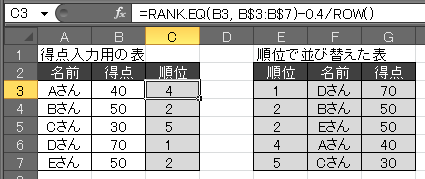
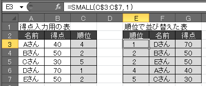
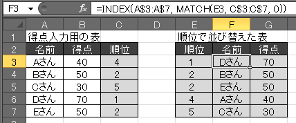

Excel の `RANK.EQ` 関数を使用すると、点数など基準に順位を求めることができます。
例えば、下記の順位のセルは、左の得点セルの値をもとに自動的に計算されています（Excel 関数によって自動計算されるセルは灰色で表示しています）。

{: .center }

- 参考: [Excel で点数などから順位を求める（RANK.EQ関数）](rank.html)

ここではさらに、この順位計算結果でソートされた表を自動的に表示する方法を考えてみます（下図の右側）。

{: .center }

左側の表には「名前」と「得点」を任意の順序で入力します（手動で入力するのはこの白色のセルのみです）。
すると、右側の表に、1 位から順番に並び替えられて「名前」や「得点」が表示されます。

左側の表の「順位」の計算は、最初の例と同様に `RANK.EQ` 関数を使って行うのですが、同じ得点に関しては同順位を返す（上記の例でいうと第 2 位が 2 つになる）という性質があり、このままでは右側の表を自動構成するときに都合が悪くなります。
そのため、「順位」の値に対して**小さな値の補正を入れてやることで、内部的に必ず一意の順位が設定されるようにします**。
具体的には、`C3` セルに下記のような式を設定します。

~~~
=RANK.EQ(B3, $B$3:$B$7)-0.4/ROW()
~~~

ポイントは、後ろの `-0.4/ROW()` という部分で、0.4 を行番号で割った数だけマイナスしています。
ただし、このままだと小数点以下まで表示されてしまうので、「セルの書式設定」で表示形式を「数値」に設定し、小数点以下を表示しないようにしてやります。
この補正を入ることで、表示上は四捨五入されて同じ順位だけど、内部的には数値が微妙に異なるという状態を実現できます。

{: .center }

次に右側の表の「順位」の列ですが、ここには上から順番に次のような数式を設定してやります。

~~~
=SMALL(C$3:C$7, 1)
=SMALL(C$3:C$7, 2)
=SMALL(C$3:C$7, 3)
=SMALL(C$3:C$7, 4)
=SMALL(C$3:C$7, 5)
~~~

これは、`C3`～`C7` セルの中から1番小さい値、2番目に小さい値、と小さい順に取り出して表示する指定です。
参照先の順位は、内部的には実数で値が保持されているので、ここのセルに関しても「セルの書式設定」で数値表示（小数点以下の桁数0）にしてやる必要があります。

{: .center }

最後に右側の表の「名前」と「得点」の列ですが、ここでは `INDEX` 関数と `MATCH` 関数を組み合わせて、左側の表の値を参照します。
下記は、`F3` セルの式です。

~~~
=INDEX(A$3:A$7, MATCH(E3, C$3:C$7, 0))
~~~

まず `MATCH` 関数で `E3` セルの値、つまり第 1 位という値が、左側の順位セル `C3`～`C7` の中で何番目に出てくるかを調べます。
ここでは、4 という値が求められます。

次に、`INDEX` 関数を使って、左側の名前セル `A3`～`A7` の中の 4 番目の値を参照しています。
これで、「Dさん」という値が自動的に表示されます。

得点の列に関しても同様で、例えば `G3` セルは次のように式が設定されています。

~~~
=INDEX(B$3:B$7, MATCH(E3, C$3:C$7, 0))
~~~

Excel シートを [こちら (rank-sort.xlsx)](rank-sort.xlsx) に置いておきますので試してみてください。

