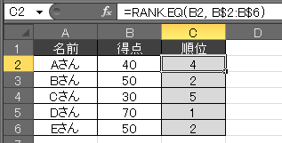

Excel の **`RANK.EQ`** 関数を使用すると、ある数字が、指定したセル範囲の中で何番目に大きい（あるいは小さい）かを調べることができます。

{: .center }

上の図で、`B2`～`B6` セルには得点が入力されており、順位の列のセルには `RANK.EQ` 関数で求めた順位が自動的に入力されています。
例えば、`C2` セルには `=RANK.EQ(B2, B$2:B$6)` という式が入力されていて、その結果 `4` という値が表示されています。
これは `B2` セルの値 (40) が、`B2`～`B6` セルの数値の中で、第 4 位の位置にあるということを示しています（大きい順に並べた時の順位）。

[RANK.EQ 関数](https://support.office.com/ja-jp/article/rank-eq-%E9%96%A2%E6%95%B0-284858ce-8ef6-450e-b662-26245be04a40)の書式は以下の通りです。

~~~
RANK.EQ(数値,範囲,[順序])
~~~

- <b>数値</b>: この値が範囲で指定した数値の中で何位なのかを調べる
- <b>範囲</b>: 順位を調べる数値の対象範囲
- <b>順序</b>: `0`: 最大の値を1位とする（デフォルト）、`1`: 最小の値を1位とする。

指定した範囲の中に同じ数字が複数存在する場合、`RANK.EQ` の結果はその中で一番上の順位になります。
例えば、上記の例では `50` という値が 2 つ含まれており、両方とも第 2 位という結果になっています（一方が第 2 位で、もう一方が第 3 位とはならない）。
その次に大きな値である `40` という値は第 4 位になります。

ここで使用した Excel ファイルは[こちらに置いてあります (rank.xlsx)](rank.xlsx) ので試してみてください。

