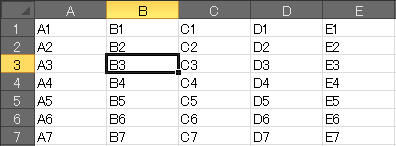
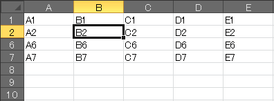
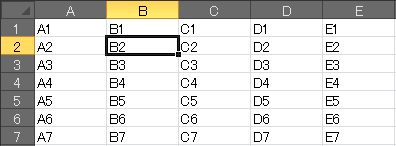
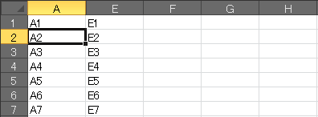

行の表示・非表示の切り替え (Ctrl+9/Ctrl+Shift+9)
----

{: .center }

セルを選択した状態で <kbd>Ctrl+9</kbd> と入力すると、それらのセルを含む行を非表示にすることができます。

{: .center }

元に戻したいときは、非表示になっている行をまたぐようにセル選択し、<kbd>Ctrl+Shift+9</kbd> と入力します。

列の表示・非表示の切り替え (Ctrl+0/Ctrl+Shift+0)
----

{: .center }

セルを選択した状態で <kbd>Ctrl+0</kbd> と入力すると、それらのセルを含む列を非表示にすることができます（行の場合は <kbd>9</kbd> でしたが、列の場合は <kbd>0</kbd> を使います）。

{: .center }

元に戻したいときは、非表示になっている列をまたぐようにセル選択し、<kbd>Ctrl+Shift+0</kbd> と入力します。

