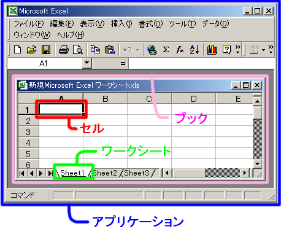

Excel アプリケーションの中では、ブックやワークシートが次のような入れ子関係で管理されています。

{: .center }

1 つの Excel ファイル (.xls や .xlsx) は、ひとつのブックとして表示されます。
ブックの中には、複数のワークシートを作成することができます。
階層構造は次のようになります （括弧の中は、VBA でのオブジェクト名）。

- アプリケーション (Application)
    - ブック (Workbook)
        - ワークシート (Worksheet)
        - ワークシート (Worksheet)
        - ワークシート (Worksheet)
            - セル (Range)
            - セル (Range)
            - セル (Range)

