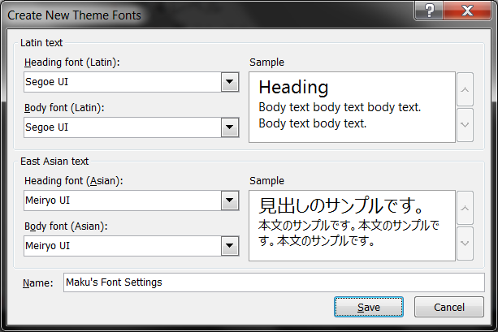

スライドで使用する「欧文フォント」と「和文フォント」を設定するには、以下のようにダイアログを開きます（PowerPoint 2010 で確認）。

1. トップメニューのリボンから <samp>View</samp> → <samp>Slide Master</samp>
2. トップメニューのリボンから <samp>Slide Master</samp> → <samp>Fonts</samp>
3. <samp>Create New Theme Fonts...</samp> を選択

{: .center }

プレゼンテーションに使うフォントは

- <b>欧文</b>: サンセリフ体のプロポーショナル
- <b>和文</b>: ゴシック体のプロポーショナル

がお勧めです。
セリフ体や明朝体は紙面での長い文書に向いています。

