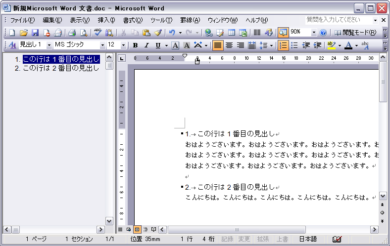

見出しマップを表示すると、章・節・項の一覧で全体の構成を確認できます。
また、それぞれの見出し位置へのジャンプも簡単にできるようになります。
見出しマップは次のように表示します。

```
メニューから「表示」→「見出しマップ」
```

すると、次のように見出しマップが表示されます。



- 関連: [Word で章・節・項の見出しを作成する](./create-chapter.html)

