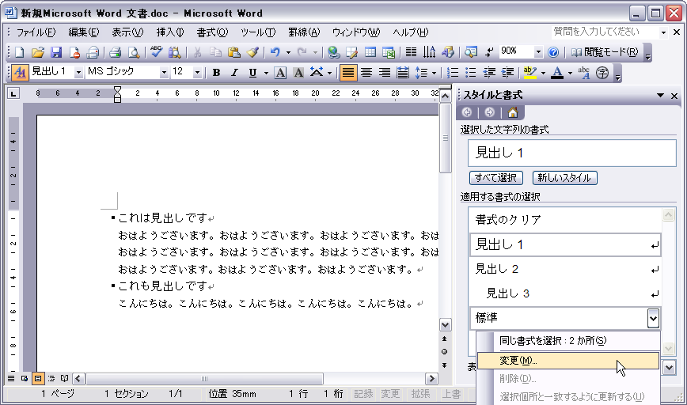
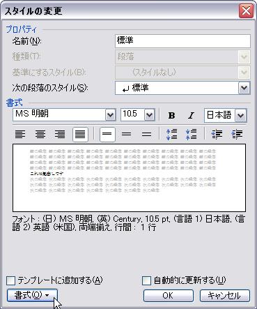
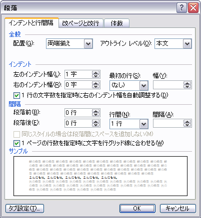
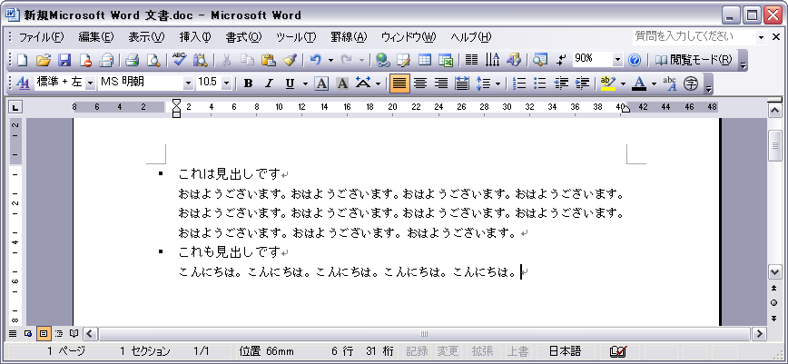
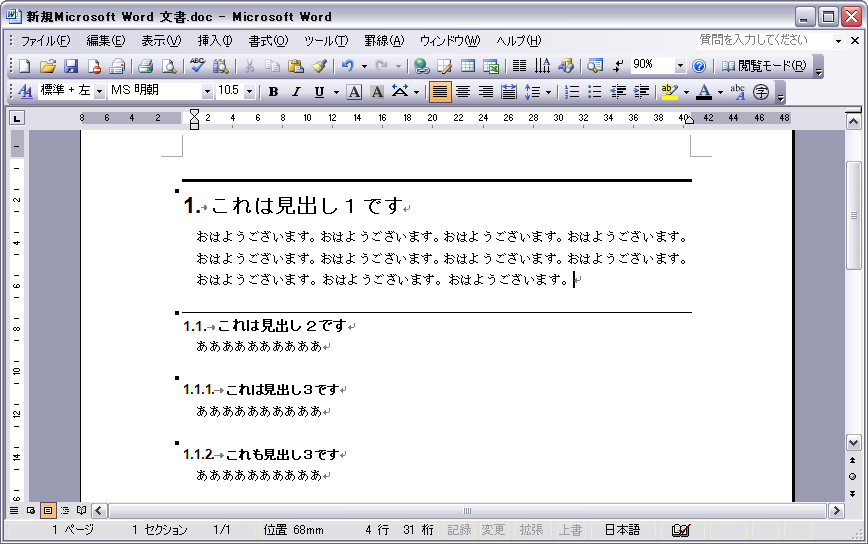

（MS Word 2003 SP1 で確認）


### (1) 「スタイルと書式」の作業ウィンドウを開く


### (2) 変更したい見出し（例えば「標準」）を右クリックして、「変更」を選択




「見出し１」や「見出し２」は「標準」で設定した書式にひきずられるみたいなので、ここでは先に「標準」のスタイルを変更します。


### (3) 「スタイルの変更」ダイアログが開くので、「書式」ボタンを押して、変更したい書式を選択

ここでは「段落」を選択します。




### (4) 「段落」ダイアログが開くので、ここでは、「左のインデント幅」を“１字”に変更してみます。



すると、「見出し１」スタイルの行も次のように一緒にインデントされてしまいます。




### (5) 「見出し１」、「見出し２」、「見出し３」の書式を上記と同様に変更し、次のように設定

```
見出し１
    フォント … ＭＳ ゴシック、18 pt、ボールド
    段落／インデントと行間隔／インデント／左のインデント幅 … ０字
    段落／インデントと行間隔／間隔／段落前 … １行
    箇条書きと段落番号／アウトライン … 1.1.1. のように番号が付くものを選択。
    罫線と網掛け／罫線 … 上に 2 pt の罫線を追加。

見出し２
    フォント … ＭＳ ゴシック、12 pt、ボールド
    段落／インデントと行間隔／左のインデント幅 … ０字
    段落／インデントと行間隔／間隔／段落前 … １行
    罫線と網掛け／罫線 … 上に 0.5 pt の罫線を追加。

見出し３
    フォント … ＭＳ ゴシック、10.5 pt、ボールド
    段落／インデントと行間隔／左のインデント幅 … ０字
    段落／インデントと行間隔／間隔／段落前 … １行
```

上記の設定により、こんな感じの見出しスタイルで表示されるようになります。



