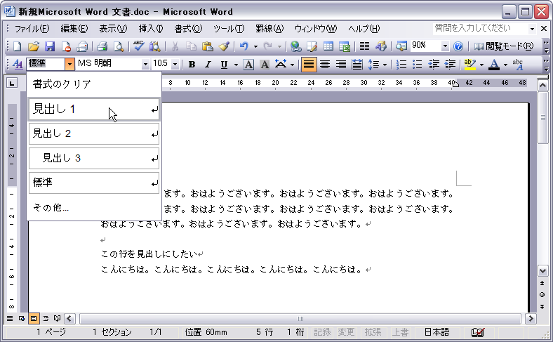
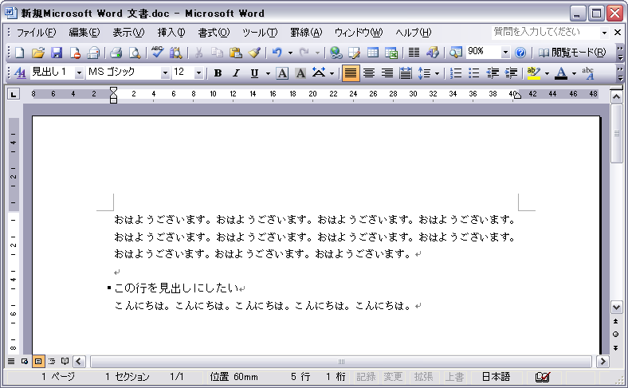

（MS Word 2003 SP1 で確認）

現在の行を章・節・項などの「見出し」として扱うようにするには、ツールバーの「スタイル」を見出しに設定します。

### 1. 見出しに設定したい行にカーソルを合わせる

### 2. ツールバーの「スタイル」を“標準”から“見出し１”などに変更する

「書式設定」のツールバーが表示されていない場合は、メニューから「表示」→「ツールバー」→「書式設定」を選択します（あるいは、メニューを右クリックして「書式設定」を選択します）。

その行のスタイル「見出し」として設定されると、印として左端に黒い点が表示されます。

