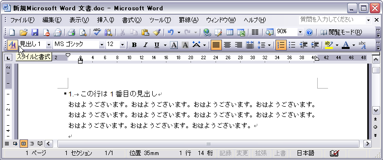
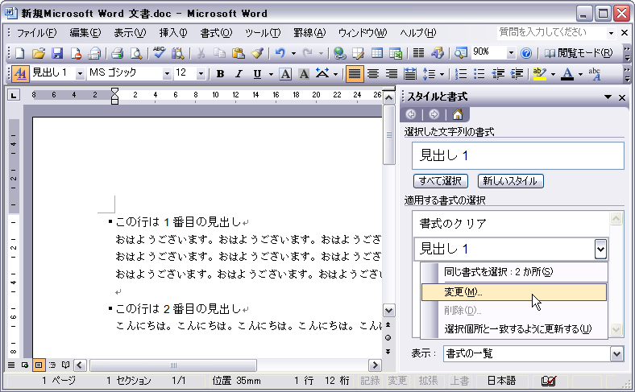
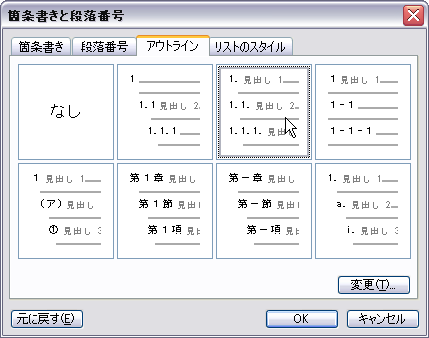
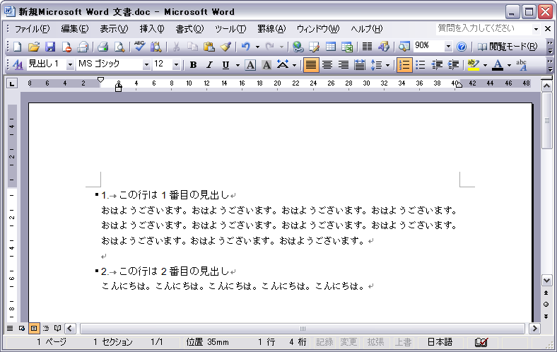

（MS Word 2003 SP1 で確認）

作成した見出しに連番を自動で付けるには次のように見出しのスタイルを変更します。

### 1. 「スタイルと書式」の作業ウィンドウを開く

### 2. 「スタイルと書式」の作業ウィンドウ上で、「見出し１」を右クリックして「変更」を選択

### 3. 「スタイルの変更」ダイアログが開くので、「書式」ボタンをクリック→「箇条書きと段落番号」を選択

### 4. 「箇条書きと段落番号」ダイアログが開くので、「アウトライン」ページから好きな形式を選択して「OK」

次のように、見出しに段落番号が振られます。

- 関連: [Word で章・節・項の見出しを作成する](./create-chapter.html)

